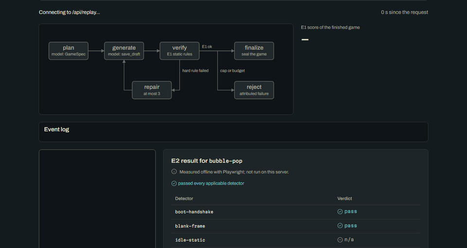
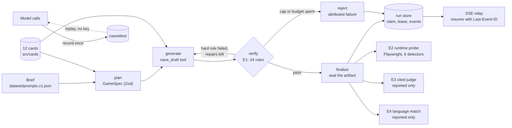

Independent reimplementation. Contains no client code, prompts, data or assets.

# cartridge

An agentic generator for single-file HTML5 mini-games, built as an explicit workflow graph and checked by a two-tier evaluator: free static rules first, then a headless runtime probe.

[](https://github.com/soneeee22000/cartridge/actions/workflows/ci.yml)
[](package.json)
[](tsconfig.json)
[](LICENSE)



**[Project page: Live demo (replayed model calls)](https://cartridge-engine.vercel.app)** (source in `site/`). The page runs the real engine on every visit. Pick one of the 20 recorded prompts and the server runs the workflow graph, the E1 verifier, the repair loop and the run lifecycle for that request, and streams every event to the page. **Only the model calls are replayed**, from cassettes recorded once with a real key. No key is deployed, so the demo costs nothing in API spend and cannot be scripted into a bill; each function instance also caps concurrent replays. The GIF above was captured at instant pace; on the page a visitor picks fast-forward (the default) or the recorded pace.

## Why this exists

**Static checks are necessary, not sufficient.** A generated game can pass every source-level rule and still be unplayable: it renders nothing, freezes after one frame, ignores taps, kills an idle player within a second, or throws half a second into play. None of that is visible in the source.

In the committed full run, **all 20 games scored 1.000 on the 24 static contract rules, and 9 of them still failed the runtime probe.** The engine's in-graph gate is the static tier, so it finalized all 9; the runtime probe in the eval harness is what caught them. That gap is the reason the evaluator has two tiers.

**Why an explicit graph.** A single tool-calling agent in a long loop can't tell you which step failed, and its repair cost is bounded only by a global step cap. Here the order of steps is code: the verifier always runs, the repair loop is capped at 3 passes with its own token budget, and every failure is attributed to the step that produced it ([ADR-0001](docs/adr/0001-explicit-workflow-graph.md)).

## What it does

| Layer               | What it does                                                                                                                                                                                                                                                   |
| ------------------- | -------------------------------------------------------------------------------------------------------------------------------------------------------------------------------------------------------------------------------------------------------------- |
| **Request**         | A short brief in English or French, from two words to a contradictory paragraph. The UI language is fixed in code at plan time from the prompt's language, not left to the model.                                                                              |
| **Workflow graph**  | A Mastra workflow with typed step I/O: `plan → dountil(build-cycle) → branch(finalize \| reject)`. `build-cycle` runs a generate phase then a verify phase. The repair loop is capped at `MAX_REPAIRS = 3`.                                                    |
| **Tools and cards** | The builder writes only through `save_draft` / `load_draft`. Twelve knowledge cards (contract, game type, input pattern, visual style) are retrieved by the plan, never by free file access.                                                                   |
| **Verifiers**       | E1, 24 deterministic contract rules, runs inside the graph on every pass; a failed hard rule sends the game back to generate with each rule's message and fix line. Every rule cites the `card:line` it enforces.                                              |
| **Eval harness**    | E2, a Playwright runtime probe with six detectors; E3, a cited categorical judge; E4, a language-match check. Tiers `one` / `sample` / `full` with a price gate, deterministic `--json` reports, and a CI diff that re-scores the committed games with no key. |

## Architecture



The model is used in exactly two places, `plan` and the generate phase. Everything else is deterministic code with unit tests, and the paths through the graph (clean pass, repair then pass, repairs exhausted, budget exhausted, truncated output, refusal) are covered with a scripted mock model. A cut stream is covered in the driver tests with hand-fed event streams.

## Results

One full run over 20 prompts I wrote, 5 per length band, generated with `claude-sonnet-5` and judged with `claude-haiku-4-5`. Source: [`reports/committed/full.json`](reports/committed/full.json). Bands are never averaged together.

| Band        | Games | E1 mean | E2 passed | Median build attempts | E4 match / abstain |
| ----------- | ----- | ------- | --------- | --------------------- | ------------------ |
| terse       | 5/5   | 1.000   | 3/5       | 2                     | 5 / 0              |
| short-brief | 5/5   | 1.000   | 2/5       | 1                     | 5 / 0              |
| full-brief  | 5/5   | 1.000   | 4/5       | 1                     | 4 / 1              |
| edge        | 5/5   | 1.000   | 2/5       | 1                     | 4 / 1              |

- **E2 failures by detector:** idle-death 4, console-error 3, tap-unresponsive 3, idle-static 2 (a game can trip more than one).
- **Repairs:** 15 games passed E1 on the first build and 5 needed one repair: E1-24 four times, E1-15 once. No run was refused, rejected or lost to a harness failure.
- **Cost:** $3.15 for the 20 items, an estimate from list prices (price table 2026-09-24), not an invoice. Median wall time per item was 62 s, measured once.
- **Noise floor:** one generation per item. With 5 items per band, one item moves a band rate by 20 points, so smaller differences are not interpretable.

**Detection matrix** ([`reports/committed/matrix.json`](reports/committed/matrix.json)). Each detector is shown catching the defect it was written for, on hand-authored fixtures that all score E1 = 1.000:

- tuning set: 6 known-bad fixtures all caught, 4 good controls all clean (the thresholds were tuned on this set);
- holdout set: 6 fixtures written after the thresholds were frozen, each with a different defect mechanism, all caught.

CI fails if any detector is disabled or left uncovered by a fixture. The matrix shows each detector can catch its defect; it does not measure how often generated games have these defects.

## The keyless demo

`GET /api/replay?promptId=<id>` creates the run in memory, drives it through the real graph and relays it as server-sent events in the same invocation ([ADR-0003](docs/adr/0003-cassette-replay-demo.md)).

- **Recording at the fetch layer.** Cassettes hold the provider's raw streamed bytes and inter-chunk gaps, keyed by the SHA-256 of the canonical request body. Prompts contain no volatile values, so a replay hashes to the recorded keys. A test replays all 20 prompts through the HTTP handler and checks each finished game against the committed one, byte for byte.
- **The public surface cannot go live.** The `api/` functions build models only through `replayModel`, which hard-codes replay mode, reads no key and has no upstream. An import-graph test fails the build if `api/**` can reach the general model factory (`src/models/port.ts`), `@libsql/client` or Playwright.
- **Reconnects and load.** A reconnect replays at instant pace and receives only the events it missed; a reconnect past a finished replay gets 204. Each instance runs at most eight replays at once and answers 429 beyond that.
- **E2 is not run on the server.** The page shows each game's committed E2 result and says so.

`GET /api/prompts` lists the replayable prompts, repaired ones first.

## Back end

- **Run lifecycle.** A run row moves `waiting → active → sealing → complete | abandoned`. A driver claims it with a conditional update, heartbeats a lease, and seals the artifact under a separate lease. A run is claimed at most `MAX_CLAIMS = 2` times (1 in the eval harness, so each item's cost belongs to one generation).
- **The terminal event comes from the row, never the stream.** A stream that ends without one is never finalized. After the terminal event the relay answers a reconnect with 204.
- **SSE relay.** Events carry sequence ids, so a client resumes with `Last-Event-ID` and receives only what it missed. The relay asks the client to reconnect before the 300 s function limit.

The contract for all of this is [`docs/SPEC.md`](docs/SPEC.md).

## Getting started

Requires Node 24.

```sh
npm ci
npm run typecheck
npm run lint
npm test
npm run check:clean-room
```

**Score a game file** (free, no key):

```sh
node src/eval/cli.ts score --file path/to/game.html
```

**Detection matrix** (free, needs Chromium):

```sh
npx playwright install chromium
npm run eval:matrix
```

**Re-score the committed games** with no key, exactly as CI does:

```sh
node src/eval/cli.ts score --games games --tier full --json /tmp/full.json
diff -u reports/committed/full.json /tmp/full.json
```

**Run the project page locally** (keyless):

```sh
cd site && npm ci && npm run dev
```

**Record new runs** (paid). Put `ANTHROPIC_API_KEY` in a git-ignored `.env`. Each run prints its estimate first, `--max-usd` stops before the next item once the running estimate passes the cap, and the `full` tier refuses to start without both `--yes` and `--max-usd`:

```sh
npm run eval:one -- --yes --max-usd 1
npm run eval:sample -- --yes --max-usd 2
npm run eval:full -- --yes --max-usd 10
```

`--resume` skips items that already have a recording; `eval:rescore -- --missing-e2` probes only games that have no E2 result.

**Build for Vercel** (Build Output API: the page plus the two functions):

```sh
cd site && npm ci && cd ..
npm run build:vercel
```

## Project structure

```text
api/                 Vercel functions: replay (SSE) and prompts
src/contract/        postMessage bridge schemas, game types, GameSpec
src/cards/           twelve knowledge cards and the anchor-resolving loader
src/engine/          workflow graph, phases, tools, run store, lifecycle driver, SSE relay
src/models/          model port, fetch-layer cassettes, replay-only models, mocks
src/eval/            E1-E4, dataset, tiers, price table, reports, CLI
src/server/          dev server and the replay handlers
fixtures/            hand-authored good controls, tuning and holdout known-bad games
dataset/             20 authored prompts with schema and privacy guard
games/, cassettes/   committed runs: every generated game and its recorded model calls
reports/committed/   the full, sample and matrix reports that CI diffs
site/                the project page (Vite, strict TypeScript)
docs/                SPEC, ADRs, research notes, media
```

## Limitations

- **The engine gates on E1 only.** E2 runs in the eval harness after a game is finalized, so the 9 games that failed E2 were still produced by the engine.
- **Four items were seen during development.** The four sample-tier items (`bubble-pop`, `kite-over-roofs`, `maze-de-haies`, `phare-long`) were run five times while the engine was being fixed, and the E1-24 fix hint and the judge schema were changed in response. For those four, the full run is not a held-out set.
- **One run.** Every result is a single generation per prompt. It shows what happened once; it is not a rate, and there is no variance estimate.
- **I wrote the prompts.** The 20 prompts are my own, not user traffic, and I chose the bands.
- **E2 thresholds are my definitions.** They were tuned on this repo's fixtures. Some fails reflect the gate, not a broken game: in `kite-over-roofs` an idle kite falls by design, and `idle-death` flags it.
- **Ten E2 results were re-probed after generation.** Chromium failed to launch for 10 games during the full run, so their E2 was run afterwards with `--missing-e2` on the same committed files: `kite-over-roofs`, `lighthouse-floors`, `maze-de-haies`, `online-chess`, `orchard-rounds`, `phare-long`, `potager-grille`, `reflexion-chrono`, `tile-sort` and `tramway-niveaux`.
- **E3 is not validated.** The judge is categorical and must cite `file:line` evidence, but it has not been compared with human raters. In the full run, 16 of its 80 labels were discarded because the cited text was not in the file. It never gates.
- **E4 was checked on 40 bundles I wrote.** Its thresholds were set on the same bundles.
- **No live generation on the public page.** Only recorded prompts can be replayed, and any change to prompts, cards or tool schemas invalidates the cassettes.
- **Cost is an estimate** from list prices, not an invoice.

Not measured at all: fun or difficulty, audio, accessibility of the games, real-device performance, multi-turn edits, languages other than English and French.

## License

[MIT](LICENSE)

## Author

Pyae Sone Kyaw · [github.com/soneeee22000](https://github.com/soneeee22000)
