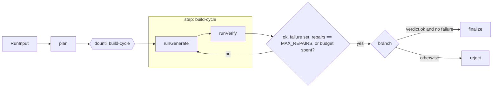
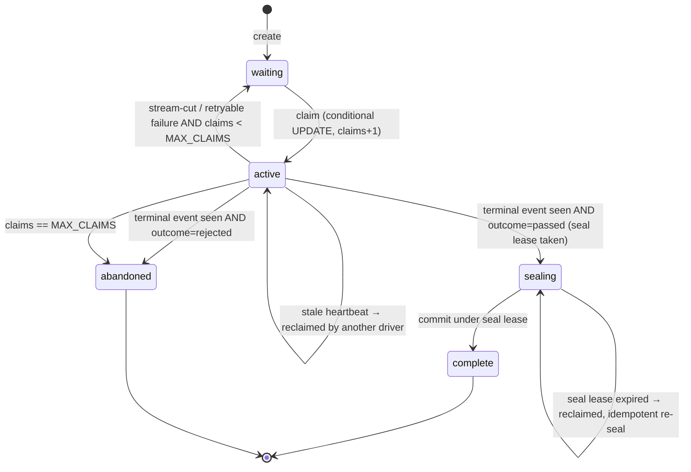

# cartridge: build contract

Status: accepted for build (revision 2, after the IP/honesty and feasibility reviews). Date: 2026-09-24. Owner: Pyae Sone (Seon).

This document is the only build contract for the engine. If code and this spec disagree, one of them gets fixed in the same commit. Section numbers (§) are stable; tests and commits cite them.

**Product in one line:** an agentic generator for single-file HTML5 mini-games. It is built as an explicit workflow graph, and its output is checked by a two-tier evaluator: free static rules first, then a headless runtime probe.

**Honesty line (README line 1, verbatim):** "Independent reimplementation. Contains no client code, prompts, data or assets."

The repo makes no deployment or real-user claims. The public page is labelled a replay of recorded model calls.

---

## 0. Ground rules

| Rule            | Consequence                                                                                                                                                                                                                                                                                                                                                                                                                                  |
| --------------- | -------------------------------------------------------------------------------------------------------------------------------------------------------------------------------------------------------------------------------------------------------------------------------------------------------------------------------------------------------------------------------------------------------------------------------------------- |
| Clean room      | Every game type, event name, card, rule text, prompt, dataset item, identifier, label and threshold here is newly authored. No number measured on, or used by, any other system appears here. `npm run check:clean-room` scans the tree for a hashed denylist of client terms (§12.3).                                                                                                                                                       |
| Runtime         | Node 24.x (`"engines": { "node": "24.x" }`), ESM (`"type": "module"`), a single package with no workspaces.                                                                                                                                                                                                                                                                                                                                  |
| TypeScript      | `strict`, `noUncheckedIndexedAccess`, `exactOptionalPropertyTypes`, `verbatimModuleSyntax`, `erasableSyntaxOnly`, `allowImportingTsExtensions`, `noEmit`. Relative imports carry the `.ts` extension so that `node file.ts` runs without a build step. No enums, namespaces or constructor parameter properties (Node strip-only rejects them; see research `mastra-api.md` §0). How `.ts` specifiers reach Vercel is settled in S1 (§13.3). |
| Dependencies    | Exact versions only (no `^`/`~`). Before any library API is used, it is checked against the installed `.d.ts` or context7 docs. Starting pins are in §13.1.                                                                                                                                                                                                                                                                                  |
| Schemas         | Zod 4 at every boundary: tool I/O, step I/O, cassettes, dataset, reports, SSE events, run rows.                                                                                                                                                                                                                                                                                                                                              |
| Tests           | Vitest, test-first. Coverage ≥ 80 % lines on `src/engine/**` and `src/eval/**`, enforced by `vitest.config.ts` thresholds.                                                                                                                                                                                                                                                                                                                   |
| Code shape      | Functions ≤ 30 lines where practical, JSDoc on every export, guard clauses, max nesting 3, named constants (no magic numbers), no TODO comments.                                                                                                                                                                                                                                                                                             |
| Starting values | Every numeric constant in this spec is a **starting value**, not a tuned result, unless the table says otherwise. Each constant's source comment says either "arbitrary cap" or "replaced by measured value from <run/report>" once that happens.                                                                                                                                                                                            |
| Secrets         | `ANTHROPIC_API_KEY` lives only in a git-ignored `.env`. No public endpoint can reach a live model (§6.3, §13.3). gitleaks runs in CI.                                                                                                                                                                                                                                                                                                        |
| Git             | Conventional commits, files added by name, one commit per slice step or more. No AI attribution lines. Never push or deploy without Seon's explicit approval.                                                                                                                                                                                                                                                                                |

### 0.1 Claims discipline

- **Words.** The repo never claims real users, a deployed live service or a key-backed deployment. `claims.test.ts` scans `README.md`, `docs/**`, `site/**` and `reports/**` for a short list of overclaim words. The list is stored as sha256 hashes with the same tokeniser as §12.3, so the test file does not itself contain the words.
- **Detector claims.** Any README or site statement about E2 says "demonstrated on N hand-authored fixtures (thresholds tuned on the same set)", with the holdout result stated next to it (§9.3). It never states a detection rate, recall or accuracy.
- **No borrowed results.** No result from any other system is cited anywhere in the repo: no defect counts from an earlier audit, no calibration corpus size, no detector accuracy figure. Only numbers produced by this repo's own commands appear.
- **Prices.** USD figures are always labelled "estimate from list prices; not an invoice".

---

## 1. Repo layout

Single package. Functions in `api/` import `../src/...` by relative path (no path aliases). The deploy bundle is built by our own esbuild script (§13.3), not by Vercel's zero-config TS compile.

```
cartridge/
  package.json  tsconfig.json  vitest.config.ts  eslint.config.js  .env.example
  README.md  CHANGELOG.md  LICENSE
  docs/
    SPEC.md                     this file
    adr/0001-explicit-workflow-graph.md
    adr/0002-two-tier-evaluator.md
    adr/0003-cassette-replay-demo.md
    research/*.md               API and platform notes (verified 2026-09-24)
  src/
    contract/
      bridge.ts                 Zod schemas for game→host and host→game messages (§2.1)
      game-types.ts             GAME_TYPES + per-type rule table (§2.2)
      spec.ts                   GameSpec schema (§4.2)
      index.ts
    cards/
      *.md                      12 knowledge cards (§3)
      index.ts                  loader: parse front matter, index lines, resolve rule anchors
    engine/
      cartridge.ts              createCartridge(deps) → { mastra, workflow } (built per run, §4.6)
      workflow.ts               the graph (§4.1), built per run by buildCartridgeWorkflow(deps)
      schemas.ts                Zod step I/O (§4.2); workflow.ts re-exports it
      stop-rules.ts             shouldStopBuilding / isFinalizable (§4.1)
      events.ts                 ProgressEvent, TerminalEvent, chunk → event mapper (§6.1)
      workflow-port.ts          startWorkflowStream port and request-context builder (§5.4)
      clock.ts                  Clock, manual clock for tests
      steps/plan.ts  steps/build-cycle.ts  steps/finalize.ts  steps/reject.ts
      phases/generate.ts  phases/verify.ts   plain functions called by build-cycle (§4.1)
      phases/model-call.ts      consumes an agent stream: tool.call events, usage, finish reason
      tools/list-cards.ts  tools/get-card.ts  tools/load-draft.ts  tools/save-draft.ts  tools/verify.ts
      tools/context.ts  tools/index.ts   request-context reader and the per-run tool factory
      prompts/planner.md  prompts/builder.md  prompts/index.ts (loader and message builders)
      budgets.ts                every engine limit as a named constant (§4.4)
      usage.ts                  provider usage → Usage mapping (§4.4)
      artifacts/{types,memory,fs}.ts     versioned artifact store (§4.3)
      run-store/{types,memory,libsql}.ts run table + event log (§5.3)
      lifecycle.ts              state machine transitions (§5)
      driver.ts                 claims a run, drives the workflow stream, finalizes (§5.4)
      relay.ts                  SSE relay (§6)
      attribution.ts            failure attribution (§4.5)
    models/
      port.ts                   ModelPort factory (§7.1)
      anthropic.ts              provider construction (@ai-sdk/anthropic)
      cassette.ts               record / replay fetch layer (§7.2)
      cassette-format.ts        Zod schema for cassette files
      request-key.ts            canonical JSON + sha256 key
      mock.ts                   test helpers around MockLanguageModelV4
      mock-game.ts              MOCK_SPEC and MOCK_GAME_HTML for the dev server's mock mode
    eval/
      e1/                       contract scorer: rules/*.ts, scan.ts (payload parser), score.ts (§2.3)
      e2/                       runtime probe: probe.ts, host.html, instrument.ts, metrics.ts, detectors.ts, thresholds.ts, bot.ts, types.ts (§8)
      e3/                       cited categorical judge: rubric.ts, validate.ts, judge.ts (§10.1)
      e4/                       language match: detect.ts, extract-ui-strings.ts, words-en.ts, words-fr.ts, labelled.json (§10.2)
      dataset/schema.ts  dataset/privacy-guard.ts (§11.1)
      tiers.ts                  one / sample / full (§11.2)
      pricing.ts                versioned price table (§11.4)
      report/{aggregate,markdown,json}.ts (§11.3)
      matrix.ts                 detection matrix check (§9.2)
      cli.ts                    `run`, `score`, `matrix` subcommands (§12)
    server/
      dev.ts                    node:http dev server that mounts the same handlers as api/
      handlers.ts               Web Request → Response handlers shared by dev server and api/
      queue.ts                  in-process driver queue (DRIVER_CONCURRENCY)
      node-adapter.ts           Web handler → Node (req, res) adapter used by the deploy bundle (§13.3)
  tests/                        vitest suites mirroring src/, api/ and scripts/
  fixtures/
    known-bad/*.html  known-bad/fixtures.json    hand-authored games used for tuning (§9.1)
    holdout/*.html    holdout/fixtures.json      hand-authored games never used for tuning (§9.3)
    good/*.html                                  one control game per game type
  dataset/prompts.v1.json       20 authored prompts (§11.1)
  cassettes/<runKey>/<key>.json                  recorded model calls (§7.3)
  games/<runKey>/a<n>.html  games/<runKey>/versions.json  games/<runKey>/run.json  games/<runKey>/e2.json
  reports/<tier>/<label>/report.md  report.json  reports/committed/<tier>.json  reports/committed/matrix.json
  api/
    prompts.ts                  GET  /api/prompts
    replay.ts                   GET  /api/replay?promptId=…  (SSE, replay-only)
  site/                         project page, built later in the /polish pass
  scripts/
    clean-room-scan.ts          hashed denylist scan (§12.3)
    record-demo.ts              records demo cassettes with a live key (local only)
    build-vercel.ts             esbuild Build Output API bundle (§13.3)
```

`games/`, `cassettes/` and `reports/committed/` are committed, so CI and the demo need no key. Each is written **the moment it exists** during a run (persist-first rule), never batched at the end.

---

## 2. Game contract

### 2.1 Bridge protocol (postMessage)

The game is one HTML file that runs inside `<iframe sandbox="allow-scripts" srcdoc=…>`. It has no same-origin, so storage APIs throw. Games talk to the host only through `postMessage`.

**Canonical helper.** Card `bridge` defines it, and every game includes it verbatim:

```js
const CARTRIDGE = {
  send(type, payload = {}) {
    window.parent.postMessage(
      { source: "cartridge", v: 1, type, payload },
      "*",
    );
  },
};
```

**Game → host events.** Zod schema `GameEvent` in `src/contract/bridge.ts` is a discriminated union on `type`:

| Event   | Payload                                               | When                                                            |
| ------- | ----------------------------------------------------- | --------------------------------------------------------------- |
| `boot`  | `{ title: string; gameType: GameType; lang: string }` | once, as soon as the first frame is drawn                       |
| `start` | `{}`                                                  | when play begins (first tap, or immediately for `toy-box`)      |
| `score` | `{ value: number }` (integer ≥ 0)                     | whenever the score changes                                      |
| `level` | `{ index: number }` (integer ≥ 1)                     | on entering a level; the first is `1` and each next one is `+1` |
| `end`   | `{ reason: EndReason; value?: number }`               | once per play-through                                           |

`EndReason = "lose" | "win" | "stuck"`. Envelope: `{ source: "cartridge", v: 1, type, payload }`. Anything with a different `source` is ignored by the host.

**Host → game commands.** Envelope `{ source: "cartridge-host", type }`, with `type ∈ { "pause", "resume", "reset" }`. `reset` must bring the game back to its pre-`start` state without reloading the page.

### 2.2 Game types and rule table

`GAME_TYPES = ["arcade-run", "stage-clear", "puzzle-board", "toy-box"] as const`.

| gameType       | Idea                                                                   | `score`  | `level`   | `end`     | allowed `end.reason` | `reset` handling                                                                                                      | E2 idle-death gate                                             | E2 idle motion required    |
| -------------- | ---------------------------------------------------------------------- | -------- | --------- | --------- | -------------------- | --------------------------------------------------------------------------------------------------------------------- | -------------------------------------------------------------- | -------------------------- |
| `arcade-run`   | continuous run, one life, survive and collect                          | required | forbidden | required  | `lose`               | soft (E1-21)                                                                                                          | yes: `end` before `IDLE_DEATH_MIN_SECONDS` after `start` fails | yes                        |
| `stage-clear`  | discrete stages, each with a goal                                      | optional | required  | required  | `win`, `lose`        | soft (E1-21)                                                                                                          | yes: same                                                      | yes                        |
| `puzzle-board` | turn-based board, no clock pressure                                    | required | optional  | required  | `win`, `stuck`       | soft (E1-21)                                                                                                          | stricter: **any** `end` during the idle window fails           | no (a still board is fine) |
| `toy-box`      | open play with a visible tally and a clear-the-table replay, no losing | optional | forbidden | forbidden | —                    | **hard (E1-24)**: `reset` is the replay path, and the game must offer an in-game control that performs the same reset | any `end` fails                                                | no                         |

A `toy-box` game can count things (placed pieces, popped bubbles) through `score`, but it has no losing condition. Its replay loop is "clear the table": the game exposes a visible control that runs the same code path as the host `reset` command, so the probe can exercise it (§8.2 step 4).

This table lives in exactly one place (`src/contract/game-types.ts`) as `GAME_TYPE_RULES: Record<GameType, TypeRules>`. E1, E2 and the cards read from it. A test checks that each type card's table matches it.

### 2.3 E1 rule list (the contract scorer)

E1 is a set of pure, deterministic functions `(html: string, ctx: { spec?: GameSpec }) → RuleResult`. There is no I/O. _(S1 note: the page is parsed once by `parseGame(html, ctx)` in `src/eval/e1/document.ts`, and each rule is a pure `check(parsed) → { status, message? }` over that parse; `scoreGame(html, ctx)` and `evaluateRule(id, html, ctx)` keep the `(html, ctx)` entry point. Parsing once avoids re-lexing the scripts 24 times.)_

- **Severity:** `hard` rules are gating, `soft` rules are scored but not gating, and `metric` rules are reported and never scored.
- **Score:** `passed / applicable` over hard and soft rules. A rule that does not apply to the declared type is `n/a` and leaves the denominator.
- **Verdict:** `ok = (hard failures === 0)`. The `verify` tool and the build-cycle's verify phase use this same verdict (§4).
- **Fix hints:** each rule carries a prescriptive `fix` string (for example "Emit `CARTRIDGE.send("start")` when play begins"). This string is exactly what the repair prompt receives.
- **Citations:** each rule declares `{ card, anchor }`. The anchor is an HTML comment `<!-- rule:E1-nn -->` at the end of the card line that states the rule. The loader resolves it to `cards/<card>.md:<line>`, and reports print that form. A test fails if any rule has zero anchors or more than one, or if an anchor names an unknown rule. Line numbers are therefore always computed and never typed by hand. _(S1 note: rules cited by "type card" (E1-15, E1-16, E1-17) have exactly one anchor in **each** of the four type cards, and E1-22 has exactly one in each of the three input cards; the citation resolves in the card for the declared type or input. `resolveAnchor(ruleId, card?)` takes the card for these rules. Every other rule has exactly one anchor in the whole card set.)_
- **Payload scan:** call sites are found with `CARTRIDGE.send("<type>"` and the payload object literal is extracted by a balanced-brace scanner that knows about strings, template literals and comments (`src/eval/e1/scan.ts`). Canvas text such as `ctx.fillText("Level 2", x, y)` is never mistaken for a `level` call site or payload.
- **Syntax check:** each classic inline `<script>` is compiled with `new vm.Script(source, { filename })` and never executed. `type="module"` scripts are forbidden by the contract (E1-09), so no subprocess and no timeout are needed.

| id    | sev    | card       | checks                                                                                                                             |
| ----- | ------ | ---------- | ---------------------------------------------------------------------------------------------------------------------------------- |
| E1-01 | hard   | game-page  | exactly one `<!doctype html>`, one `<html>…</html>`, and no nested `<iframe>`                                                      |
| E1-02 | hard   | game-page  | no external references: no `http(s):` or `//` URL in `src`, `href`, CSS `url()`, `@import` or `import()`; `data:` URIs are allowed |
| E1-03 | hard   | game-page  | `<html lang>` is present and is a well-formed BCP-47 tag (primary subtag of 2–3 letters, optional region)                          |
| E1-04 | soft   | game-page  | `<meta name="viewport">` includes `width=device-width`                                                                             |
| E1-05 | hard   | game-page  | no network APIs: `fetch(`, `XMLHttpRequest`, `WebSocket`, `EventSource`, `sendBeacon`                                              |
| E1-06 | hard   | game-page  | no persistence APIs: `localStorage`, `sessionStorage`, `indexedDB`, `document.cookie`                                              |
| E1-07 | hard   | game-page  | no dynamic code: `eval(`, `new Function(`, and `setTimeout`/`setInterval` with a string argument                                   |
| E1-08 | soft   | game-page  | no blocking dialogs: `alert(`, `confirm(`, `prompt(`                                                                               |
| E1-09 | hard   | game-page  | every inline script is classic (no `type="module"`) and compiles under `vm.Script`                                                 |
| E1-10 | hard   | bridge     | the `CARTRIDGE` helper is defined with `source: "cartridge"` and `v: 1`                                                            |
| E1-11 | hard   | bridge     | `boot` is emitted with the payload keys `title`, `gameType`, `lang`                                                                |
| E1-12 | soft   | bridge     | if `boot.lang` is a string literal, it equals `<html lang>`                                                                        |
| E1-13 | hard   | bridge     | `start` is emitted                                                                                                                 |
| E1-14 | hard   | bridge     | `boot.gameType` is a string literal in `GAME_TYPES` (and equals `spec.gameType` when a spec is given)                              |
| E1-15 | hard   | type card  | every event that is _required_ for the declared type has at least one call site                                                    |
| E1-16 | hard   | type card  | no event that is _forbidden_ for the declared type has a call site                                                                 |
| E1-17 | soft   | type card  | every string-literal `end.reason` is in the type's allowed set                                                                     |
| E1-18 | soft   | bridge     | the `score.value` payload is not a string literal                                                                                  |
| E1-19 | soft   | bridge     | the `level` payload has an `index` key                                                                                             |
| E1-20 | soft   | bridge     | the game listens for `message` events and handles `pause` and `resume` from `source: "cartridge-host"`                             |
| E1-21 | soft   | bridge     | the game handles the `reset` command (`n/a` for `toy-box`, where E1-24 replaces it)                                                |
| E1-22 | soft   | input card | pointer input is registered (`pointerdown`, `pointerup`, `pointermove` or `touchstart`)                                            |
| E1-23 | soft   | game-page  | the layout adapts to the viewport (a `resize` listener, or `innerWidth`/`innerHeight`, or `dvh`/`vw` units)                        |
| E1-24 | hard   | toy-box    | `toy-box` only: the game handles the `reset` command **and** an in-game control element calls the same reset function              |
| M-01  | metric | —          | document size in bytes                                                                                                             |
| M-02  | metric | —          | number of inline scripts                                                                                                           |
| M-03  | metric | —          | call-site count per bridge event                                                                                                   |
| M-04  | metric | —          | visible UI string count (input to E4)                                                                                              |

"type card" means the card for the declared game type (`arcade-run` and so on). "input card" means the card for `spec.input` when a spec is given, otherwise `tap-anywhere`.

---

## 3. Knowledge cards

There are 12 original markdown cards in `src/cards/`. Each has front matter (`id`, `kind`, `title`, `summary`, `related: string[]`), and its body is short (≤ 60 lines) and prescriptive.

| kind         | ids                                                    |
| ------------ | ------------------------------------------------------ |
| contract (2) | `game-page`, `bridge`                                  |
| type (4)     | `arcade-run`, `stage-clear`, `puzzle-board`, `toy-box` |
| input (3)    | `tap-anywhere`, `drag-follow`, `swipe-lanes`           |
| style (3)    | `paper-cut`, `chalkboard`, `risograph`                 |

- **Card requirements:** each type card restates its row of the §2.2 table and includes a minimal loop skeleton. Each style card gives a 4-colour palette, the drawing primitives to use, and what to avoid. All art is drawn in code, and each input card gives the pointer-event wiring.
- **Loader:** `src/cards/index.ts` exports `listCards()` (sorted by id), `getCard(id)` → `{ id, kind, title, body, lines: string[] }`, and `resolveAnchor(ruleId)` → `{ card, line }`.
- **Runtime file access:** the loader resolves card files from `CARTRIDGE_ASSET_ROOT` (default: the repo root, derived from `import.meta.url`). The deploy bundle copies the card directory next to the function (§13.3).
- **Deterministic retrieval:** cards are always returned sorted by id and serialised with stable key order, so the prompt prefix is byte-stable across runs. This is intended to allow prompt caching; whether caching actually happens is not assumed. Reports show the measured `cacheRead` tokens per step (§11.3), and S4 records in `docs/research/` whether repair passes read from cache.
- **Out of scope:** an MCP server for the cards. Cards reach the model through typed tools only (§4.3).

---

## 4. Workflow graph

### 4.1 Shape and Mastra constructs

Verified constructs (`@mastra/core` 1.70.0, research `mastra-api.md` §1): `createWorkflow`, `createStep`, `.then`, `.dountil(step, cond)`, `.branch([[cond, step], …])`, `.commit()`, `writer.custom({ type: "data-…" })`, and `run.stream()` → `fullStream` + `result`.

_(S2 note: steps, agents and tools close over one run's dependencies, so the graph is built per run by `buildCartridgeWorkflow(deps)` inside `createCartridge` rather than held as a module-level `cartridgeWorkflow` constant; `CartridgeWorkflow = ReturnType<typeof buildCartridgeWorkflow>`. The shape below is unchanged.)_

**Decision: the loop body is one step, not a nested workflow.** A nested `createWorkflow` used as the `.dountil` body fails to type-check under this repo's `exactOptionalPropertyTypes` (TS2379: `Workflow.description: string | undefined` is not assignable to `Step.description?: string`; adding a description does not help). Dropping the flag or adding a cast would weaken the rules, so the loop body is a single `build-cycle` step whose `execute` calls two plain functions in order. The probe and its result are recorded in `mastra-api.md` §1.7.



```ts
const buildCycleStep = createStep({
  id: "build-cycle",
  inputSchema: BuildState,
  outputSchema: BuildState,
  requestContextSchema: CartridgeContext,
  execute: async ({ inputData, requestContext, writer }) => {
    const generated = await runGenerate(inputData, { requestContext, writer });
    return runVerify(generated, { writer });
  },
});

export const cartridgeWorkflow = createWorkflow({
  id: "cartridge-run",
  inputSchema: RunInput,
  outputSchema: RunOutput,
  requestContextSchema: CartridgeContext,
  options: { autoRestartActiveRuns: false },
})
  .then(planStep) // RunInput → BuildState (buildAttempt 0, verdict null, failure null)
  .dountil(buildCycleStep, async ({ inputData }) =>
    shouldStopBuilding(inputData),
  )
  .branch([
    [async ({ inputData }) => isFinalizable(inputData), finalizeStep],
    [async ({ inputData }) => !isFinalizable(inputData), rejectStep],
  ])
  .commit();
```

- **Why the loop is shaped this way:** `.dountil` always runs its body at least once. That matches our semantics: the first pass through `build-cycle` is the initial generation (build attempt 0), and every later pass is a repair. There is never an empty repair pass.
- **Stop rule:** `shouldStopBuilding(s) = s.failure !== null || s.verdict?.ok === true || s.repairs >= MAX_REPAIRS || s.repairTokens >= REPAIR_TOKEN_BUDGET || s.runTokens >= RUN_TOKEN_BUDGET`. `isFinalizable(s) = s.failure === null && s.verdict?.ok === true`. Both are pure functions with their own unit tests. The iteration cap comes from `repairs`, not from `iterationCount`, so the rule can be tested without Mastra.
- **`runGenerate` and `runVerify`** live in `src/engine/phases/` and are plain async functions `(BuildState, deps) → BuildState`. They are unit-tested without Mastra. Each one catches its own errors and records them in `state.failure` (§4.5); neither throws for an expected failure.
- **Branch output:** `.branch` output is keyed by step id (`{ finalize: … }` or `{ reject: … }`). `RunOutput = z.object({ finalize: FinalizeOut.optional(), reject: RejectOut.optional() })`.
- **`autoRestartActiveRuns`** is a per-workflow `options` field (`workflows/types.d.ts`), set to `false` because the driver owns recovery (§5).

### 4.2 Typed step I/O (Zod, in `src/engine/workflow.ts` unless noted)

```ts
RunInput   = { runKey: string /* dataset item id or demo id; never a random id */, prompt: string }
GameSpec   = { title: string /*≤48*/, slug: /^[a-z0-9]+(-[a-z0-9]+)*$/ /*≤40*/, lang: "en" | "fr",
               gameType: GameType, loop: string /*≤280*/, input: InputCardId, style: StyleCardId }   // src/contract/spec.ts
Finding    = { ruleId: string, severity: "hard" | "soft", message: string, fix: string, citation: string }
Verdict    = { ok: boolean, score: number, errors: Finding[], warnings: Finding[] }
Usage      = { input: number, output: number, cacheRead: number, cacheWrite: number }   // disjoint kinds, §4.4
StepFailure = { step: "plan" | "generate" | "verify-static", code: FailureCode, message: string, retryable: boolean }
AttemptRec = { buildAttempt: number, mode: "initial" | "repair", artifact: ArtifactRef | null,
               verdict: Verdict | null, usage: Usage, finishReason: string | null,
               repairOf: string[] /* rule ids that caused it */ }
BuildState = { runKey, prompt, spec: GameSpec | null /* null only when plan failed */,
               langSource: "detector" | "planner", planUsage: Usage,
               buildAttempt: number, repairs: number,
               artifact: ArtifactRef | null, verdict: Verdict | null, failure: StepFailure | null,
               runTokens: number, repairTokens: number, history: AttemptRec[] }
FinalizeOut = { outcome: "passed", spec: GameSpec, artifact: ArtifactRef, html: string, verdict: Verdict, history: AttemptRec[] }
RejectOut   = { outcome: "rejected", spec: GameSpec | null, attribution: Attribution, history: AttemptRec[] }
CartridgeContext = { runKey: string, claimAttempt: number, buildAttempt: number }   // requestContextSchema
```

| step / phase          | in → out                   | what it does                                                                                                                                                                                                                                                                                                                                                                                                                                                                                                                                                                                                                                                                                                                        |
| --------------------- | -------------------------- | ----------------------------------------------------------------------------------------------------------------------------------------------------------------------------------------------------------------------------------------------------------------------------------------------------------------------------------------------------------------------------------------------------------------------------------------------------------------------------------------------------------------------------------------------------------------------------------------------------------------------------------------------------------------------------------------------------------------------------------- |
| `plan` (step)         | `RunInput → BuildState`    | The UI language is fixed in code at plan time: the step runs the E4 detector (§10.2) on the prompt. Then it calls agent `planner` (tools `list_cards`, `get_card`) through `agent.stream()` with `structuredOutput: { schema: GameSpec }` and awaits `object` and `totalUsage`. If the detector returned `en` or `fr`, that value overwrites `spec.lang` (`langSource: "detector"`). If it returned `unknown`, the planner's schema-valid `en`/`fr` value is kept (`langSource: "planner"`). A test covers both paths. It emits `data-cartridge {kind:"plan.spec"}`.                                                                                                                                                                |
| `build-cycle` (step)  | `BuildState → BuildState`  | Sets `buildAttempt` in `requestContext`, then calls `runGenerate` and `runVerify` in order. It emits `data-cartridge {kind:"phase.start"}` before each phase, because Mastra's own `step.start`/`step.result` events only ever name `build-cycle` (§6.1).                                                                                                                                                                                                                                                                                                                                                                                                                                                                           |
| `runGenerate` (phase) | `BuildState → BuildState`  | Loads the 5 cards named by the spec (`game-page`, `bridge`, the type, the input, the style) in id order. It calls agent `builder` (tools `get_card`, `load_draft`, `save_draft`) through `agent.stream()` with `maxSteps: GENERATE_MAX_STEPS` and `maxOutputTokens: BUILDER_MAX_OUTPUT_TOKENS`, consumes the stream, and awaits `totalUsage` and `finishReason`. In repair mode the prompt holds the previous attempt's `errors[]` as `ruleId + message + fix` lines, plus the instruction to call `load_draft` first. **The artifact is taken from the artifact store for `(runKey, buildAttempt)`, never from model text.** If nothing was saved, the attempt records `artifact: null` and `failure.code = generate-no-artifact`. |
| `runVerify` (phase)   | `BuildState → BuildState`  | Runs the E1 scorer (the same function the `verify` tool wraps) on the artifact, stores the `Verdict`, and increments `buildAttempt`. _(S2: `repairs` is incremented by `runGenerate` when it starts a repair pass, which gives the same count: the initial pass plus at most `MAX_REPAIRS` repairs.)_ It emits `data-cartridge {kind:"verify.verdict"}`. It is skipped when `failure` is already set.                                                                                                                                                                                                                                                                                                                               |
| `finalize` (step)     | `BuildState → FinalizeOut` | A pure packaging step. Committing the result to the run row is the driver's job, under the lease (§5.4).                                                                                                                                                                                                                                                                                                                                                                                                                                                                                                                                                                                                                            |
| `reject` (step)       | `BuildState → RejectOut`   | Builds the `Attribution` from `state.failure`, or from the last verdict and budgets when `failure` is null (§4.5).                                                                                                                                                                                                                                                                                                                                                                                                                                                                                                                                                                                                                  |

**Why every model call streams.** With the Anthropic provider, `agent.generate()` sends a non-streaming request (no `stream` flag; observed). A non-streaming call that writes up to `MAX_GAME_BYTES` of HTML can wait longer than undici's default 300 s `headersTimeout` before any header arrives. `agent.stream()` sends headers at once, keeps the connection alive, and gives the cassette layer one response format to handle (§7.2). This applies to `planner`, `builder` and the E3 `judge`.

Prompts (`src/engine/prompts/*.md`) are newly authored. They contain no run id, timestamp or other volatile value, so cassette keys and prompt prefixes are stable (§7.2).

### 4.3 Tools (Mastra `createTool`, Zod I/O)

The tool name the model sees is the **object key**, so keys equal ids (`tools: { save_draft: saveDraft }`). No generic file or shell tool exists. Tools that touch the artifact store are built inside `createCartridge(deps)` and reach the store through that closure (§4.6), never through a module-level singleton.

| tool         | input                                   | output                                                 | notes                                                                                                                                                                                                                   |
| ------------ | --------------------------------------- | ------------------------------------------------------ | ----------------------------------------------------------------------------------------------------------------------------------------------------------------------------------------------------------------------- |
| `list_cards` | `{ kind?: CardKind }`                   | `{ cards: { id, kind, title, summary }[] }`            | sorted by id                                                                                                                                                                                                            |
| `get_card`   | `{ id: CardId }`                        | `{ id, body }`                                         | unknown id → a Zod error the model sees                                                                                                                                                                                 |
| `load_draft` | `{}`                                    | `{ draft: { version: string, html: string } \| null }` | returns the newest saved version for the run. `runKey` comes from `context.requestContext`, never from model input                                                                                                      |
| `save_draft` | `{ html: string /*≤ MAX_GAME_BYTES*/ }` | `{ version: "a<n>", bytes, sha256 }`                   | idempotent per `(runKey, buildAttempt)`: a second save in the same build attempt overwrites it. `runKey` and `buildAttempt` come from `context.requestContext`. The result has no run id, so replays are byte-identical |
| `verify`     | `{ html: string }`                      | `Verdict`                                              | the E1 scorer. Used by the eval CLI and tests, and **not** given to the builder agent, so the repair loop stays explicit and attributable                                                                               |

`ArtifactStore` interface: `put(runKey, buildAttempt, html) → ArtifactRef`, `latest(runKey)`, `get(ref)`. There are two implementations:

- `MemoryArtifactStore`: for Vercel and tests.
- `FsArtifactStore`: writes `games/<runKey>/a<n>.html` plus `versions.json` (`{ versions: { version, sha256, bytes }[] }`, sorted by version number). Each file is written the moment `put` returns.

### 4.4 Budgets and usage (`src/engine/budgets.ts`, `src/engine/usage.ts`)

All values are **starting values**. After the `sample` tier has run (§11.2), each constant's comment says either "arbitrary cap, not tuned" or which measured value replaced it.

| constant                    | start value | kind          | meaning                                         |
| --------------------------- | ----------- | ------------- | ----------------------------------------------- |
| `MAX_REPAIRS`               | 3           | design choice | repair passes after the initial generation      |
| `GENERATE_MAX_STEPS`        | 6           | arbitrary cap | agent steps inside one `runGenerate` call       |
| `PLAN_MAX_STEPS`            | 4           | arbitrary cap | agent steps inside `plan`                       |
| `BUILDER_MAX_OUTPUT_TOKENS` | 48_000      | arbitrary cap | `maxOutputTokens` per builder call              |
| `PLANNER_MAX_OUTPUT_TOKENS` | 4_000       | arbitrary cap | `maxOutputTokens` per planner call              |
| `JUDGE_MAX_OUTPUT_TOKENS`   | 4_000       | arbitrary cap | `maxOutputTokens` per E3 judge call             |
| `REPAIR_TOKEN_BUDGET`       | 300_000     | arbitrary cap | total tokens (all kinds) spent in repair passes |
| `RUN_TOKEN_BUDGET`          | 520_000     | arbitrary cap | total tokens (all kinds) for the whole run      |
| `MAX_GAME_BYTES`            | 120_000     | arbitrary cap | upper bound on one HTML artifact                |

_(S2: the schemas live in `src/engine/schemas.ts` and `workflow.ts` re-exports them, so phases and the driver import them without importing the graph. `spec` is nullable and `planUsage` is recorded; `FinalizeOut` carries `spec` and `html` because the driver commits both to the row and has no artifact store; `RejectOut` carries `spec` for reports. With structured output, Mastra reports a planner call that ended on `length` or `content-filter` as finish reason `error` plus a `STRUCTURED_OUTPUT_TRUNCATED` error whose `details.finishReason` holds the model's reason; `plan` reads it from there. Research `mastra-api.md` §6.)_

**Thinking and effort.** Without an explicit setting, Sonnet 5 uses adaptive thinking, which makes output length, cost and recordings vary. Each role sets its thinking/effort mode explicitly through `providerOptions.anthropic`, from named constants in `budgets.ts` (`BUILDER_THINKING`, `PLANNER_THINKING`). S2 reads the exact option shape from `@ai-sdk/anthropic@4.0.62`'s type definitions before writing it, and records it in `mastra-api.md`. _(S2: both are `{ thinking: { type: "disabled" } }`, a starting choice so output length does not vary with adaptive thinking; the request body carries `"thinking":{"type":"disabled"}`.)_

**Usage mapping (`toUsage`).** The AI SDK's normalised `inputTokens` already **includes** cache reads (observed: `inputTokens: 14` = uncached 10 + `cachedInputTokens` 4). Adding `inputTokens` and `cachedInputTokens` would count cache reads twice. So:

- `Usage.cacheRead = cachedInputTokens`
- `Usage.cacheWrite = cacheCreationInputTokens`
- `Usage.input = inputTokens − cachedInputTokens − cacheCreationInputTokens`
- `Usage.output = outputTokens`

The four kinds are disjoint, budgets sum all four, and §11.4 prices each kind separately. A unit test pins the observed example above. S2 also checks, against a recorded response with a non-zero cache write, that `inputTokens` includes `cacheCreationInputTokens`; if it does not, the formula and the test change together. `raw` is never read, because on `totalUsage` it holds only the last step's usage.

Token counts come from our own sum of each agent call's `totalUsage`. Mastra's workflow-level usage read zero in the probe (research `mastra-api.md` §4), so it is never trusted.

### 4.5 Failure attribution (`src/engine/attribution.ts`)

`Attribution = { step: "plan" | "generate" | "verify-static" | "finalize" | "driver", code: FailureCode, buildAttempt: number, ruleIds: string[], message: string, retryable: boolean }`

**Where attribution comes from.** Mastra's `result.steps` cannot attribute a failure inside `build-cycle`: a throw in either phase shows only `build-cycle: failed` (observed). So every engine function catches its own errors and converts them into a `StepFailure { step, code }` in `BuildState.failure`, which stops the loop and routes to `reject`. The driver classifies only what happens outside the workflow (§5.4). A thrown error that still escapes the workflow is classified by the driver as `engine-crashed` (step `driver`), never guessed from `result.steps`.

| code                   | step            | retryable                       | source                                                                                                                                                                                                                                      |
| ---------------------- | --------------- | ------------------------------- | ------------------------------------------------------------------------------------------------------------------------------------------------------------------------------------------------------------------------------------------- |
| `plan-invalid-spec`    | plan            | no                              | the structured output failed `GameSpec`, or the planner stopped with `finishReason: "length"`                                                                                                                                               |
| `generate-no-artifact` | generate        | no                              | the final attempt saved nothing                                                                                                                                                                                                             |
| `generate-truncated`   | generate        | no                              | the builder call ended with `finishReason: "length"` (the provider maps both `max_tokens` and `model_context_window_exceeded` to it). A cut-off `save_draft` call leaves invalid tool JSON, so the attempt is not repaired                  |
| `contract-unmet`       | **generate**    | no                              | repairs were exhausted with hard failures. The blame goes to the phase that _produced_ the artifact, and `ruleIds` are the remaining hard failures. The verify phase detected the problem; it did not cause it                              |
| `budget-exhausted`     | generate        | no                              | a token budget was hit before `ok`                                                                                                                                                                                                          |
| `verifier-crashed`     | verify-static   | no                              | an exception inside E1 (a harness bug)                                                                                                                                                                                                      |
| `model-refusal`        | plan / generate | no                              | the call ended with `finishReason: "content-filter"` (the provider's mapping of a `refusal` stop reason)                                                                                                                                    |
| `model-error`          | plan / generate | from `APICallError.isRetryable` | the model call threw an `APICallError` (for example a 529 "Overloaded"). `retryable` is copied from `isRetryable`, and `statusCode` goes into `message`. The provider makes one fetch per call and does not retry, so retries are ours (§5) |
| `cassette-miss`        | plan / generate | no                              | replay mode threw `CassetteMissError` (identified by `instanceof`, not by message text)                                                                                                                                                     |
| `stream-cut`           | driver          | yes                             | the workflow stream ended without `workflow-finish` (§5.2)                                                                                                                                                                                  |
| `lease-lost`           | driver          | yes                             | a heartbeat or the conditional finalize update matched 0 rows (§5.4)                                                                                                                                                                        |
| `engine-crashed`       | driver          | no                              | an error escaped the workflow without a `StepFailure` (a harness bug)                                                                                                                                                                       |

- **Test:** each code has a test that forces it (a mock model, an injected fault or a hand-made stream) and asserts `{ step, code }`. `generate-truncated` is forced with a mock whose final turn ends with `finishReason: "length"` mid tool call.

### 4.6 Per-run dependencies (`src/engine/cartridge.ts`)

The cassette directory, the artifact store and the model mode differ per run, while Mastra registers agents and tools statically. The engine therefore builds a fresh Mastra instance per run:

```ts
createCartridge(deps: {
  models: { planner: MastraModelConfig; builder: MastraModelConfig };  // from createModel (§7.1)
  artifacts: ArtifactStore;
  clock: Clock;
}): { mastra: Mastra; workflow: typeof cartridgeWorkflow }
```

- Agents are constructed inside `createCartridge` with `deps.models`. Tools are constructed inside it and close over `deps.artifacts`. _(S2 verify: they close over a `RunScopedArtifacts` view of `deps.artifacts`, which only sees drafts saved by this run. A persistent `FsArtifactStore` keeps `a<n>` files from earlier runs of the same run key, and without the view `runGenerate` could take a leftover file for this attempt's save and `load_draft` could show the builder another run's draft.)_
- _(S2: `deps.clock` was dropped because nothing inside the workflow reads the time; the driver and run store take the clock. `deps.verify` is an optional scorer override, used by the `verifier-crashed` test. Agents set `maxRetries: 0` so every retry is the driver's.)_
- `InMemoryStore` is Mastra's storage for every instance. Building one per run is cheap, and it keeps runs isolated from each other in the same process.
- No module in `src/engine/**` holds per-run state at module level. An eslint rule (`no-restricted-syntax` on top-level `let`) and a test that runs two cartridges with different stores in parallel enforce this. _(S2: a local config-protection hook refuses edits to `eslint.config.js`, so the rule is enforced by `tests/engine/module-state.test.ts` instead, which parses every file in `src/engine/**` and `src/models/**` with the TypeScript API and fails on a top-level `let` or `var`. Moving it into the eslint config is an open item for Seon.)_

---

## 5. Run lifecycle

### 5.1 States

The run table uses its own state vocabulary: `waiting`, `active`, `sealing`, `complete`, `abandoned`.



All values are starting values and arbitrary caps, not tuned.

| constant                | start value |
| ----------------------- | ----------- |
| `MAX_CLAIMS`            | 2           |
| `MAX_CLAIMS_EVAL`       | 1           |
| `HEARTBEAT_INTERVAL_MS` | 20_000      |
| `STALE_ACTIVE_MS`       | 75_000      |
| `SEAL_LEASE_MS`         | 30_000      |

### 5.2 Invariants (each one has a test)

1. **Single winner.** A claim is one conditional update: `UPDATE runs SET status='active', claims=claims+1, owner=?, heartbeat_at=? WHERE id=? AND claims < max_claims AND (status='waiting' OR (status='active' AND heartbeat_at < ?) OR (status='sealing' AND seal_until < ?))`. The caller wins only if `rowsAffected === 1`. Test: two concurrent claims on one store produce exactly one winner.
2. **Never seal without a terminal event.** The driver moves to `sealing` only after it has consumed a `workflow-finish` chunk with `workflowStatus: "success"` **and** found `finalize` in the branch output. A stream that closes without `workflow-finish` counts as `stream-cut`. Test: the driver's injected `startWorkflowStream` port (§5.4) returns a hand-made async iterable that stops before `workflow-finish`; the run ends `waiting` (or `abandoned` at the cap), never `complete`.
3. **Seal under lease.** `active → sealing` sets `seal_owner`, `seal_until`. `sealing → complete` is conditional on `status='sealing' AND seal_owner=?`. Sealing is idempotent: re-committing the same `artifact.sha256` is a no-op.
4. **Retries only for retryable failures.** Deterministic failures (`contract-unmet`, `cassette-miss`, `model-refusal`, `generate-truncated` and the rest marked "no" in §4.5) go straight to `abandoned`. Retrying them would spend again for a different game.
5. **Eval runs use `MAX_CLAIMS_EVAL = 1`**, so each dataset item's cost and outcome belongs to exactly one generation.
6. **Terminal state lives on the row only.** `complete` and `abandoned` are read from the run row, never inferred from the stream (§6).
7. **A lost lease stops the run.** When `heartbeat()` returns `false`, the driver cancels the workflow run, stops appending events, discards the result and records nothing further (§5.4).

### 5.3 Store interface (`src/engine/run-store/types.ts`)

```ts
interface RunStore {
  create(input: {
    id: string;
    runKey: string;
    prompt: string;
    maxClaims: number;
  }): Promise<RunRow>;
  get(id: string): Promise<RunRow | null>;
  claim(id: string, owner: string, now: number): Promise<boolean>;
  heartbeat(id: string, owner: string, now: number): Promise<boolean>;
  beginSeal(id: string, owner: string, now: number): Promise<boolean>;
  completeSeal(
    id: string,
    owner: string,
    result: CompleteResult,
  ): Promise<boolean>;
  abandon(
    id: string,
    owner: string,
    attribution: Attribution,
  ): Promise<boolean>;
  release(
    id: string,
    owner: string,
    attribution: Attribution,
  ): Promise<boolean>; // back to waiting
  appendEvent(id: string, event: ProgressEvent): Promise<number>; // returns seq
  listEvents(id: string, afterSeq: number): Promise<StoredEvent[]>;
}
```

- **`RunRow`:** `{ id, runKey, prompt, status, claims, maxClaims, owner, heartbeatAt, sealOwner, sealUntil, spec, artifact, e1Score, attribution, createdAt, updatedAt }`.
- **`MemoryRunStore`:** a `Map`. Each method runs its check and write synchronously inside one call, so there is no `await` between the check and the write.
- **`LibSqlRunStore`:** `@libsql/client`, with tables `runs` and `run_events(run_id, seq, type, data_json, at, PRIMARY KEY(run_id, seq))`. Every transition is one `UPDATE … WHERE` statement. The URL comes from `CARTRIDGE_DB_URL` (default `file:.data/cartridge.db`, absolute-resolved). It is never imported from `api/**` (§14 S5).
- **Shared tests:** one contract test suite (`run-store.contract.test.ts`) runs against both implementations. It uses an injected `Clock` (`{ now(): number }`), so tests never sleep.
- **Mastra's own storage:** `InMemoryStore` everywhere. Mastra snapshots are not our run table.

### 5.4 Driver (`src/engine/driver.ts`)

`driveRun(runId, deps)` where `deps` includes a `startWorkflowStream(input, ctx) → { fullStream: AsyncIterable<Chunk>, result: Promise<WorkflowResult>, cancel(): Promise<void> }` port. The real port wraps `createCartridge(...)` + `workflow.createRun()` + `run.stream()` + `run.cancel()`; tests pass hand-made iterables.

1. Claim the run, or return.
2. Build a typed `RequestContext` (`CartridgeContext`) with `runKey`, `claimAttempt` (the row's `claims` after the claim) and `buildAttempt: 0`. The build-cycle step updates `buildAttempt` before each agent call; tools read both from `context.requestContext`.
3. Call `startWorkflowStream`.
4. For each chunk, map it to a `ProgressEvent` and `appendEvent`. Heartbeat every `HEARTBEAT_INTERVAL_MS`. **If `heartbeat()` returns `false`**, call `cancel()`, stop consuming the stream, discard the result and return without writing to the row (another driver owns it now). Test: a store whose heartbeat flips to `false` mid-run; the driver appends no further events and never calls `beginSeal`.
5. At the end of the stream, apply §5.2 (2).
6. Then run `beginSeal → completeSeal`, `abandon` or `release`, using the `Attribution` from the reject output, or the driver's own code (`stream-cut`, `lease-lost`, `engine-crashed`, or `model-error`/`cassette-miss` when the error reached the driver).
7. **Cancellation.** `driveRun` accepts an `AbortSignal`. When it fires, the driver calls `cancel()` and releases the run with `stream-cut`. `/api/replay` passes `request.signal`, so a client disconnect stops both the run and the relay loop (§6.3).

The local dev server runs drivers in-process through a small queue (`DRIVER_CONCURRENCY = 2`, arbitrary cap). No external queue is needed.

---

## 6. SSE relay

### 6.1 Wire format

```
id: <seq>
event: progress | terminal | reconnect
data: <JSON, one line>

: ping            (comment heartbeat every RELAY_HEARTBEAT_MS)
```

`ProgressEvent` is a discriminated union on `kind`, persisted in `run_events`:

| kind             | data                                              | source                                                              |
| ---------------- | ------------------------------------------------- | ------------------------------------------------------------------- |
| `run.claimed`    | `{ claimAttempt }`                                | driver                                                              |
| `step.start`     | `{ step }`                                        | `workflow-step-start` (`plan`, `build-cycle`, `finalize`, `reject`) |
| `step.result`    | `{ step, status }`                                | `workflow-step-result`                                              |
| `phase.start`    | `{ phase: "generate" \| "verify", buildAttempt }` | `data-cartridge`                                                    |
| `plan.spec`      | `{ spec, langSource }`                            | `data-cartridge`                                                    |
| `tool.call`      | `{ phase, tool }`                                 | `data-cartridge` (emitted by tool wrappers)                         |
| `verify.verdict` | `{ buildAttempt, ok, score, errors: string[] }`   | `data-cartridge`                                                    |
| `repair.start`   | `{ buildAttempt, fromRules: string[] }`           | `data-cartridge`                                                    |
| `usage`          | `{ phase, buildAttempt, usage }`                  | `data-cartridge`                                                    |
| `run.released`   | `{ attribution }`                                 | driver                                                              |

**Step ids in the stream.** Because `build-cycle` is a single step (§4.1), `workflow-step-start` and `workflow-step-result` name `build-cycle` once per loop pass and never an inner phase. All per-phase progress therefore comes from `data-cartridge` custom chunks, which reach the outer `fullStream` (observed). For the record: when a nested workflow is used instead, its inner events carry dotted ids (`build-cycle.generate`); the mapper rejects any dotted id with a test, so a future switch cannot silently change the event log.

`TerminalEvent` (`event: terminal`) is `{ status: "complete" | "abandoned", artifact?: { version, sha256, html }, e1Score?, attribution? }`. **It is built only from the run row**, after the relay reads a row whose status is `complete` or `abandoned`. The workflow stream never produces it.

### 6.2 Behaviour (`src/engine/relay.ts`)

- On connect, read `Last-Event-ID` (or `?after=`). Send stored events with `seq > after`, then tail the store every `RELAY_POLL_MS`.
- As soon as the row is terminal and every stored event has been sent, send `terminal` (its id is `last seq + 1`) and close.
- **After terminal, no reconnect loop.** The client calls `es.close()` when it receives `terminal`. The server also answers `204 No Content` to any request whose `Last-Event-ID` is ≥ the terminal id, because a 204 stops `EventSource` auto-reconnect. Test: a request with `Last-Event-ID` equal to the terminal id gets 204 and no body.
- Send the heartbeat comment every `RELAY_HEARTBEAT_MS`. Before `RELAY_BUDGET_MS`, send `event: reconnect` and close, and let `EventSource` re-attach with `Last-Event-ID`.
- A client that attaches after `complete` receives the full log plus `terminal`. That is the same answer a client connected from the start got.
- The relay loop stops when `request.signal` aborts.

| constant             | start value                                             |
| -------------------- | ------------------------------------------------------- |
| `RELAY_POLL_MS`      | 200 (arbitrary)                                         |
| `RELAY_HEARTBEAT_MS` | 12_000 (arbitrary)                                      |
| `RELAY_BUDGET_MS`    | 270_000 (kept below the function's 300 s `maxDuration`) |

### 6.3 Endpoints

| route                       | where           | behaviour                                                                                           |
| --------------------------- | --------------- | --------------------------------------------------------------------------------------------------- |
| `POST /runs`                | dev server only | `{ prompt, promptId? }` → `202 { runId }`. It writes a `waiting` row, then enqueues it              |
| `GET /runs/:id/events`      | dev server only | the relay (§6.2) over `LibSqlRunStore`                                                              |
| `GET /api/prompts`          | dev + Vercel    | the demo prompt list: `{ id, prompt, lang, lengthBand }[]` for the prompts that have a cassette set |
| `GET /api/replay?promptId=` | dev + Vercel    | **single-invocation replay**. See below                                                             |

How `/api/replay` works:

- It creates the run in a fresh `MemoryRunStore`, runs the real driver and workflow with the model hard-wired to `replay` mode, and relays over the same store within one invocation. On Vercel, separate invocations may land on different instances, so a request/relay split would lose in-memory state.
- **Function config:** `export const config = { maxDuration: 300 }` in `api/replay.ts`, mirrored as `"maxDuration": 300` in the function's `.vc-config.json` by the bundle script (§13.3).
- **Re-attach:** replay is deterministic, so a reconnect with `Last-Event-ID: n` re-runs the replay with `REPLAY_PACE=instant` and emits only `seq > n`, or answers 204 when `n` ≥ the terminal id (§6.2). Test: two replays of the same prompt produce identical `(seq, kind, data)` sequences.
- **Pacing:** `?pace=recorded|fast` (default `fast`). `recorded` spaces events by the recorded inter-chunk gaps, capped at `REPLAY_MAX_GAP_MS = 1_500` (arbitrary).
- **Disconnect:** `request.signal` is passed to `driveRun` and to the relay, so a closed tab stops the run.
- **The only thing canned is the model call.** Plan, tools, artifact store, E1 verify, the repair loop, the lifecycle and the relay all run for real.

---

## 7. Model layer

### 7.1 Port (`src/models/port.ts`)

```ts
type ModelRole = "planner" | "builder" | "judge";
type ModelMode = "live" | "record" | "replay" | "mock";
createModel(role: ModelRole, mode: ModelMode, opts: { cassetteDir?: string; mock?: MockScript }): MastraModelConfig
```

| role             | model id           |
| ---------------- | ------------------ |
| planner, builder | `claude-sonnet-5`  |
| judge            | `claude-haiku-4-5` |

- **Mode selection:** `CARTRIDGE_MODEL_MODE` picks the mode, and the default is `replay`. `live` and `record` need `ANTHROPIC_API_KEY` and throw at startup without it.
- **`anthropic.ts`:** `createAnthropic({ apiKey, fetch? })` from `@ai-sdk/anthropic` returns a `LanguageModelV4`, which Mastra accepts as `model` (research `mastra-api.md` §4, option B).
- **Replay needs a placeholder key.** The provider calls `loadApiKey` inside `getHeaders()` on every request, before our `fetch` runs, and throws `AI_LoadAPIKeyError` when no key is set (observed). In `replay` and `mock` modes, `createAnthropic` receives `apiKey: REPLAY_PLACEHOLDER_KEY` (`"replay-no-key"`), and the environment key is never read. The cassette layer never stores or sends headers, so the placeholder goes nowhere. Test: replay runs to `complete` with `ANTHROPIC_API_KEY` deleted from `process.env`.
- **Sampling:** the judge runs at `temperature: 0`. The builder and planner leave sampling at the defaults: for models flagged `rejectsSamplingParameters` (Sonnet 5), the provider silently drops `temperature`/`topP`/`topK` with a warning, so setting them would be misleading. Determinism for the demo comes from cassettes, not from sampling.
- _(S2: `MockScript` is a `LanguageModelV4` built by `mock.ts`, so `port.ts` never imports `ai/test` and the deploy bundle never pulls in a devDependency. `mock.ts` also exports `demoMockModels()`, the stateless planner/builder pair the dev server uses in `mock` mode.)_
- **`mock.ts`:** thin helpers around `MockLanguageModelV4` from `ai/test` (a devDependency), plus `scriptedTurns([...])`, which scripts tool-call and text turns (streamed) for unit tests, including a turn that ends with `finishReason: "length"` or `"content-filter"`. `MockLanguageModelV3` from `ai@7` must not be used (it fails to type-check).

### 7.2 Cassette (`src/models/cassette.ts`)

- **Mechanism:** record and replay sit at the **HTTP fetch layer** of the Anthropic provider: `createAnthropic({ apiKey, fetch: cassetteFetch(mode, dir) })`. The `fetch` option is confirmed in `@ai-sdk/anthropic@4.0.62`'s settings type (research `mastra-api.md` §4). The replayed bytes are exactly what the provider returned, including the `usage` block.
- **One response format.** Every model call streams (§4.2), so every cassette body is `text/event-stream`. In `record` mode, a request whose body lacks `stream: true` throws `CassetteFormatError`, so a non-streaming call cannot slip in unnoticed. `gapsMs` therefore always has chunks to space out.
- **Key:** `sha256(canonicalJson({ url: pathname, body: parsedRequestBody }))`, written as `sha256:<hex>`. Canonical JSON sorts keys recursively and drops `undefined` values. Headers are never part of the key and are **never stored**.
- **Volatile guard:** before hashing, `assertNoVolatile(body)` throws if it finds a UUID or an ISO timestamp anywhere in the body. This protects replay determinism. (The probe found none in Mastra-built request bodies.)
- **Modes:**
  - `record` calls the network. It writes the cassette file immediately **only for a 2xx response**; a non-2xx response is returned to the provider (which throws `APICallError`) and is never written, so a replay can never reproduce a failure.
  - `replay` never touches the network. A missing key throws `CassetteMissError`, which maps to `cassette-miss`.
  - `live` passes through without recording.
- **Duplicate requests:** within one run, identical requests get an occurrence index (`key#1`, `key#2`) so that repeated identical calls replay in order.
- _(S2 details: record mode reads the whole 2xx body before handing it to the provider, then writes the file; `gapsMs` has one entry per SSE event, so `pace=recorded` replays event by event. The occurrence counter advances only when a cassette is written, so a failed call that is retried does not shift the index. `index.json` entries are `key` for occurrence 0 and `key#n` after that. A request whose body is not a JSON string throws `CassetteFormatError`.)_
- **Fallback (not expected to be needed):** a hand-rolled `CassetteModel implements LanguageModelV3` (`@ai-sdk/provider@3.0.14`, research §2.2), which records and replays stream parts instead of HTTP bodies, with the same `key` and `request` fields and `response.parts` in place of `response.body`.

### 7.3 Cassette file format (`cassette-format.ts`, Zod)

Path: `cassettes/<runKey>/<hex-key>[.<occurrence>].json`, plus `cassettes/<runKey>/index.json`, which lists the keys in call order.

```json
{
  "format": "cartridge-cassette/1",
  "key": "sha256:…",
  "occurrence": 0,
  "role": "builder",
  "model": "claude-sonnet-5",
  "request": { "url": "/v1/messages", "body": {} },
  "response": {
    "status": 200,
    "contentType": "text/event-stream",
    "body": "<raw response text>",
    "gapsMs": [0, 42, 38]
  },
  "usage": { "input": 0, "output": 0, "cacheRead": 0, "cacheWrite": 0 },
  "priceTableVersion": "2026-09-24"
}
```

- `response.status` is always 2xx and `response.contentType` is always `text/event-stream` (Zod literals).
- `gapsMs` records the per-chunk gaps for `pace=recorded`.
- `usage` is computed with `toUsage` (§4.4) from the provider's usage fields, so the four kinds are disjoint.
- CI secret scan: a test fails if any cassette contains `x-api-key`, `authorization`, an `sk-ant-` prefix or the placeholder key.

---

## 8. E2 runtime probe (`src/eval/e2/`)

E2 uses Playwright Chromium and `pngjs`. It is not run on Vercel, where the page shows committed E2 results and says so.

### 8.1 Harness

- `host.html` embeds the game as `<iframe sandbox="allow-scripts" srcdoc=…>` at `PROBE_VIEWPORT = { width: 360, height: 640 }`. This matches the demo page's sandbox, so storage and same-origin mistakes surface here too.
- The host records every `message` with `source: "cartridge"` along with a `performance.now()` timestamp.
- **Instrumentation:** the probe injects one `<script>` (`instrument.ts`) into the srcdoc **immediately after the opening `<head…>` tag**, or immediately after the opening `<html…>` tag when there is no `<head>`. It is never prepended before `<!doctype html>`, which would put the page in quirks mode and change the layout E2 measures. It is the only change made to the game. It forwards `error`, `unhandledrejection` and `console.error` to the host as `{ source: "cartridge-probe", kind, message }`. This avoids depending on Playwright surfacing errors from sandboxed child frames. S3 checks whether `page.on("pageerror")` also sees them and records the answer in `docs/research`. _(S3 answer, `docs/research/e2-calibration.md`: with Playwright 1.63.0 `pageerror` does see uncaught exceptions and unhandled rejections from the sandboxed frame, and `console.error` arrives only as a `console` event. The probe keeps its own forwarder; a test pins both observations.)_ Tests: the instrumented document still starts with the doctype, and `document.compatMode` in the probed frame is `"CSS1Compat"`.
- **Frames:** a frame is `iframe.screenshot()`, which captures composited pixels. Fixtures cover DOM and 2D canvas games; WebGL is a non-goal (§15) and is not claimed.
- **Metrics (`metrics.ts`, pure, tested with in-memory PNGs):**
  - luma stddev
  - distinct RGBA colour count
  - motion ratio: the share of pixels whose summed |ΔR|+|ΔG|+|ΔB| exceeds `MOTION_CHANNEL_DELTA_MIN`

### 8.2 Sequence and detectors

1. Load the host and wait for `boot` (≤ `BOOT_TIMEOUT_MS`).
2. Tap the centre (`START_TAP`) and wait for `start` (≤ `START_TIMEOUT_MS`). `toy-box` may already have sent it.
3. **Idle window:** from `start`, send no input for `IDLE_WINDOW_SECONDS`. Take frames A and B `FRAME_GAP_MS` apart early in the window, and log any `end` with its time since `start`.
4. `reset`, then `start` again. Tap and take frames before and after with `FRAME_GAP_MS`.
5. **Random-tap bot (reported only):** `BOT_TRIALS` trials, each up to `BOT_TRIAL_MAX_SECONDS`. The bot taps at intervals drawn from a PRNG seeded per item (`bot.ts`, mulberry32, seed = hash of the item id). It records `longestPlaySeconds = max(time to end)`, or the trial cap if the game never ended.

| detector id        | gate | fails when                                                                                                                                             | applies to                  |
| ------------------ | ---- | ------------------------------------------------------------------------------------------------------------------------------------------------------ | --------------------------- |
| `boot-handshake`   | hard | no valid `boot` within `BOOT_TIMEOUT_MS`, or the `boot` payload fails the Zod schema, or `boot.gameType`/`lang` differ from the static values          | all                         |
| `blank-frame`      | hard | frame A has `stddev < BLANK_LUMA_STDDEV_MIN` **or** `distinctColours < BLANK_DISTINCT_COLOURS_MIN`                                                     | all                         |
| `idle-static`      | hard | motion(A, B) `< IDLE_MOTION_RATIO_MIN`                                                                                                                 | `arcade-run`, `stage-clear` |
| `tap-unresponsive` | hard | motion(before tap, after tap) `< TAP_MOTION_RATIO_MIN`                                                                                                 | all                         |
| `idle-death`       | hard | `arcade-run`/`stage-clear`: `end` arrives less than `IDLE_DEATH_MIN_SECONDS` after `start`. `puzzle-board`/`toy-box`: any `end` inside the idle window | all                         |
| `console-error`    | hard | any forwarded `error`, `unhandledrejection` or `console.error`                                                                                         | all                         |

`longestPlaySeconds` is **reported only** and never gates. E2 passes when every applicable detector passes.

_(S3 notes on the sequence: in step 2 the probe taps only if `start` has not already arrived; if `start` never arrives, the idle window is timed from the tap. Frame A is taken `IDLE_FRAME_DELAY_MS` after `start`. Step 4 waits `RESET_SETTLE_MS` after `reset` before the "before" frame and does not require a second `start`, because a `toy-box` game has no pre-`start` screen to return to. Detectors are pure functions of an `Observation` value (`types.ts`), so the matrix can re-evaluate one browser run under different registries.)_

### 8.3 Thresholds (`thresholds.ts`)

_(S3: frozen. Every value below was kept; `docs/research/e2-calibration.md` gives the margins. `thresholds.ts` also exports four harness constants that are not thresholds: `IDLE_FRAME_DELAY_MS = 400`, `RESET_SETTLE_MS = 300`, `BOT_TAP_GAP_MIN_MS = 120` and `BOT_TAP_GAP_MAX_MS = 700`, all arbitrary and listed in the same note.)_

These are the starting values. S3 tunes them on this repo's own `fixtures/good` and `fixtures/known-bad` and then freezes them. `docs/research/e2-calibration.md` records the measured metric for every fixture next to each threshold, so a reader can see the margin, and gives, for each threshold, the reason for its final value in terms of those measurements only. `IDLE_DEATH_MIN_SECONDS` in particular starts at 4 as an unmeasured guess; its frozen value is whatever the fixture calibration supports, and the calibration note states that derivation.

| constant                     | start value |
| ---------------------------- | ----------- |
| `PROBE_VIEWPORT`             | 360 × 640   |
| `BOOT_TIMEOUT_MS`            | 4_000       |
| `START_TIMEOUT_MS`           | 2_500       |
| `FRAME_GAP_MS`               | 180         |
| `BLANK_LUMA_STDDEV_MIN`      | 3.5         |
| `BLANK_DISTINCT_COLOURS_MIN` | 6           |
| `MOTION_CHANNEL_DELTA_MIN`   | 30          |
| `IDLE_MOTION_RATIO_MIN`      | 0.001       |
| `TAP_MOTION_RATIO_MIN`       | 0.002       |
| `IDLE_DEATH_MIN_SECONDS`     | 4           |
| `IDLE_WINDOW_SECONDS`        | 6           |
| `BOT_TRIALS`                 | 3           |
| `BOT_TRIAL_MAX_SECONDS`      | 25          |

Output file: `games/<runKey>/e2.json` = `{ detectors: Record<DetectorId, "pass" | "fail" | "n/a">, metrics: {...}, longestPlaySeconds, consoleErrors: string[] }`. It is written the moment the probe finishes.

---

## 9. "Static ≠ quality": known-bad fixtures and the detection matrix

**What this section shows, and what it does not.** The fixtures are built so that E1 scores 1.000 and one E2 detector fires, and the thresholds are tuned on those same fixtures. So the matrix demonstrates _by construction_ that E1 alone can pass a broken game and that each detector can catch the defect it was written for. It does not measure how often either happens in generated games. The claims rule in §0.1 applies to every statement built on it.

### 9.1 Tuning fixtures

Every fixture is hand-authored. It **scores E1 = 1.000 (all hard and soft rules pass)** and is built to trip exactly one E2 detector.

| fixture                                                                                        | gameType     | defect (runtime only)                                                          | expected detector  |
| ---------------------------------------------------------------------------------------------- | ------------ | ------------------------------------------------------------------------------ | ------------------ |
| `kb-01-dead-boot.html`                                                                         | arcade-run   | the `boot` call sits in a function that is never invoked                       | `boot-handshake`   |
| `kb-02-ink-on-ink.html`                                                                        | stage-clear  | draws every shape in the background colour                                     | `blank-frame`      |
| `kb-03-single-frame.html`                                                                      | arcade-run   | draws once, with no `requestAnimationFrame` loop                               | `idle-static`      |
| `kb-04-wrong-target.html`                                                                      | toy-box      | the pointer listener is attached to a zero-size element (reset control intact) | `tap-unresponsive` |
| `kb-05-spawn-kill.html`                                                                        | arcade-run   | the first obstacle spawns on the player, so an idle player dies almost at once | `idle-death`       |
| `kb-06-late-throw.html`                                                                        | puzzle-board | a `TypeError` in the update loop shortly after start                           | `console-error`    |
| `good-arcade-run.html`, `good-stage-clear.html`, `good-puzzle-board.html`, `good-toy-box.html` | each         | none                                                                           | none               |

`fixtures/known-bad/fixtures.json` is Zod-validated: `{ id, file, gameType, expectedDetector, allowedCoFires: DetectorId[], coFireReason?: string }[]`. `allowedCoFires` is normally empty. Any entry must carry a one-line reason in `coFireReason` (for example: a single-frame game also looks unresponsive to taps). _(S3: the only co-fire is on `kb-02-ink-on-ink`, which also trips `idle-static` and `tap-unresponsive`, because a page drawn in one colour cannot show motion. Good controls have no manifest; the matrix finds them as `fixtures/good/good-<gameType>.html`.)_

### 9.2 Matrix check (`npm run eval:matrix`)

The check fails with exit 1 if any of these hold for the tuning fixtures:

1. a fixture's E1 score is not exactly `1.000`;
2. a known-bad fixture does not trip its `expectedDetector`;
3. it trips a detector outside `{expectedDetector} ∪ allowedCoFires`;
4. a good control trips any detector;
5. **a registered detector is disabled or covered by no fixture.** Detectors live in a registry (`detectors.ts`: `{ id, enabled, run }[]`). The `--disable <id>` flag exists only to prove this check.

Test (`matrix.test.ts`, mutant-style): for each detector id, running the matrix with `--disable <id>` must exit 1. With nothing disabled it must exit 0.

The matrix writes `reports/committed/matrix.json` (verdicts only, sorted keys), with `tuning` and `holdout` sections. _(S3: the matrix probes with the random-tap bot skipped, since it reads verdicts only and the bot never gates; it probes `MATRIX_CONCURRENCY = 3` fixtures at a time in one Chromium. `longestPlaySeconds` is still produced by `probeGame` whenever a bot budget is passed, as the S4 run path will. The stdout lists each fixture's raw metrics for the calibration note. Because the probe is async, `cli.ts` gains an async `main()` that dispatches `matrix` and falls back to the synchronous `runCli` for `score`.)_ CI re-runs it and diffs the verdicts. Raw metrics are excluded from the diff, because frame timing in headless Chromium is not byte-stable.

### 9.3 Holdout fixtures

- **One per detector:** `fixtures/holdout/` holds six more hand-authored known-bad games, one per detector, each with a defect that differs in mechanism from its tuning counterpart (for example, a `boot` payload with a wrong key instead of a `boot` that never fires). Each still scores E1 = 1.000.
- **Order of work:** holdout fixtures are written **after** the thresholds are frozen and committed, and the commit that adds them does not touch `thresholds.ts`. A test asserts that `thresholds.ts` equals the values in `e2-calibration.md`, and the calibration note lists only tuning fixtures.
- _(S3 result, recorded as measured: all six holdout fixtures tripped their target detector; `ho-02-stuck-veil` also tripped `tap-unresponsive`, allowed because an opaque veil hides every tap change. The holdout commit does not touch `thresholds.ts`.)_
- **Reported, not tuned away:** holdout verdicts are recorded in `matrix.json` under `holdout` and printed in the README as they are, including misses. A holdout miss does not fail `eval:matrix` (which would invite retuning); a change to any holdout verdict does fail the CI diff. Changing a threshold after the holdout exists requires a new holdout fixture per affected detector, and the calibration note says so.

---

## 10. E3 judge and E4 language

### 10.1 E3: cited categorical judge (`src/eval/e3/`)

- **When it runs:** only with a key (`record`) or from committed cassettes (`replay`). It uses model `claude-haiku-4-5` at temperature 0 with structured output, through `agent.stream()` like every other model call.
- **Input:** the prompt, the `GameSpec`, and the game HTML with 1-based line numbers prefixed.
- **Dimensions** (newly authored; categorical only; no numbers anywhere in the rubric). Each dimension asks a question about the game's source that a reader can check against the cited lines:

| dimension            | question                                                                                      | labels                           |
| -------------------- | --------------------------------------------------------------------------------------------- | -------------------------------- |
| `prompt-coverage`    | which nouns and verbs from the brief have a corresponding object, rule or action in the code? | `covered`, `partly`, `missed`    |
| `goal-legibility`    | is there on-screen text or a drawn cue that states what the player is trying to do?           | `stated`, `implied`, `absent`    |
| `feedback-on-input`  | does a player input produce a visible change within the same handler or the next drawn frame? | `immediate`, `indirect`, `none`  |
| `fail-state-clarity` | when play ends, does the game show why it ended and how to play again? (`n/a` for `toy-box`)  | `explained`, `abrupt`, `missing` |

- **Output schema:** `{ findings: { dimension, label, evidence: { line: number, quote: string }[], rationale: string }[] }`.
- **Validation (`validate.ts`, pure):** a finding is discarded when
  - `evidence` is empty;
  - `line` falls outside `[1, lineCount]`;
  - the whitespace-normalised `quote` (≥ `E3_MIN_QUOTE_CHARS = 6`) is not found on `line ± E3_LINE_TOLERANCE (1)`;
  - the rationale contains a numeric claim (`E3_NUMERIC_CLAIM` regex: a number followed by `%`, `/n`, "out of", "points", "fps" or "ms").
- **Null, not zero:** a dimension with no surviving finding is `null` (not measured), never the worst label. `n/a` (does not apply to this type) is reported separately from `null`. An unparseable response makes every dimension `null` and records `judgeError`.
- **Reports** show the label distribution and the null count per length band. They never convert labels to numbers and never average them.

### 10.2 E4: language match (`src/eval/e4/`)

- _(S2: a first `detect.ts` with authored word lists landed in S2 because `plan` needs it; `lang` is `unknown` when the hit margin is below `DETECT_MIN_MARGIN = 1`. S4 extends it with the extraction, abstention floor and labelled set.)_
- **Detection:** `detectLanguage(text) → { lang: "en" | "fr" | "unknown", margin }` uses authored function-word lists (`words-en.ts`, `words-fr.ts`), matched on word boundaries. The `plan` step (§4.2) uses the same function, so the language fixed in code at plan time and the later check come from one implementation.
- **UI string extraction:** text nodes outside `script`/`style`, plus the string literal arguments of `fillText(`, `strokeText(`, and of assignments to `textContent`, `innerText` and `innerHTML` (tags stripped).
- **Excluded from the evidence:** the slug, identifiers, CSS, numbers, and strings of ≤ 2 characters.
- **Abstention floor:** E4 abstains when there are fewer than `E4_MIN_STRINGS = 4` distinct strings, fewer than `E4_MIN_LETTERS = 30` letters, or the margin is below `E4_MIN_MARGIN = 2`. These are starting values, set on the labelled set below.
- **Output:** `{ verdict: "match" | "mismatch" | "abstain", promptLang, uiLang, htmlLang, evidence: string[] }`. The score is 1, 0 or `null` respectively, and an abstention is never counted as a pass.
- **Labelled set (`labelled.json`):** 40 authored UI-string bundles (16 EN, 16 FR, 8 deliberately hard: mixed-language, very short, or cognate-heavy), each labelled `en`, `fr` or `abstain-expected`. `e4.test.ts` computes accuracy and abstention rate on it, and the report prints both with the note "measured on 40 authored bundles; the thresholds were set on the same bundles". This is the only E4 accuracy figure the repo states.

---

## 11. Dataset, tiers and reports

### 11.1 Dataset (`dataset/prompts.v1.json`)

Twenty prompts, all authored for this repo. None comes from real users or any client source.

| lengthBand    | rule                                                                 | items | EN  | FR  |
| ------------- | -------------------------------------------------------------------- | ----- | --- | --- |
| `terse`       | 1–4 words                                                            | 5     | 3   | 2   |
| `short-brief` | 5–40 words                                                           | 5     | 3   | 2   |
| `full-brief`  | 41–160 words                                                         | 5     | 3   | 2   |
| `edge`        | > 160 words, **or** `probes` contains `contradiction` or `off-scope` | 5     | 3   | 2   |

Schema (`src/eval/dataset/schema.ts`):

```ts
DatasetItem = { id: /^[a-z0-9-]{3,40}$/, lengthBand: LengthBand, lang: "en" | "fr", prompt: string,
                intendedType: GameType | null, probes: string[], origin: "authored" }
Dataset     = { version: "v1", items: DatasetItem[] }
```

`probes` names what an item is designed to test (for example `contradiction`, `off-scope`, `names-a-colour`, `asks-for-sound`). `intendedType` is the type the author had in mind, or `null` when the brief deliberately leaves it open.

Checks on the whole dataset:

- ids are unique;
- the word count fits the length band (except for `edge` items carrying the probes above);
- each length band has both languages;
- every game type appears as `intendedType` at least twice.

**Privacy guard (`privacy-guard.ts`).** It rejects any item containing:

- an email address, URL, UUID, or ISO date or time;
- a run of 8 or more digits;
- an `@handle`;
- any token whose sha256 matches the clean-room denylist (§12.3).

`dataset.test.ts` runs the schema and the guard over the committed file.

### 11.2 Tiers (`src/eval/tiers.ts`)

| tier     | items | selection                                                                                                                                                                            |
| -------- | ----- | ------------------------------------------------------------------------------------------------------------------------------------------------------------------------------------ |
| `one`    | 1     | the single id in `ONE_ITEM_ID`: an EN `short-brief` item whose `intendedType` is `arcade-run`                                                                                        |
| `sample` | 4     | the ids in `SAMPLE_ITEM_IDS`: chosen so that each of the four game types is the `intendedType` of exactly one item, and each length band appears once; a test checks both properties |
| `full`   | 20    | all items                                                                                                                                                                            |

- **Cost guard:** before any paid call, the CLI prints an estimate (`items × EST_TOKENS_PER_ITEM`, priced with §11.4). After `sample` has run, `EST_TOKENS_PER_ITEM` is replaced by the measured `sample` mean, and that source is written next to the constant.
- **`full` needs flags:** it refuses to start without `--yes` and `--max-usd <n>`. It aborts before the next item once the running estimate passes `--max-usd`.
- **Seon approves `full`** after seeing the estimate (plan A3).

### 11.3 Report (`src/eval/report/`)

**Outcomes.** Each item has exactly one:

| outcome           | meaning                                                                                   |
| ----------------- | ----------------------------------------------------------------------------------------- |
| `game`            | `complete`, with an artifact                                                              |
| `contract-failed` | `abandoned`, with `contract-unmet`, `budget-exhausted` or `generate-truncated`            |
| `refusal`         | `model-refusal`                                                                           |
| `harness-failure` | any error in our code, `cassette-miss`, `verifier-crashed`, `engine-crashed` or a timeout |

Refusals and harness failures are counted separately and **never** mixed into quality means. Means use only `game` items.

**`report.md` sections, in order:**

1. Run header: tier, dataset version, model ids, price table version, and the git sha of the scorer.
2. **Per-band table**, one row per length band:
   - n, games, contract-failed, refusals, harness failures
   - E1 mean/min
   - E2 pass count and per-detector fail counts
   - E3 label distribution with null and `n/a` counts
   - E4 match/mismatch/abstain
   - median build attempts

   There is **no cross-band mean**: the table has no "all" row for quality metrics, only for counts and cost.

3. Repair loop: the build-attempts histogram, and which rule ids triggered repairs.
4. Failures by attributed step (§4.5).
5. Cost and latency: tokens by kind (input, output, cache read, cache write, each disjoint per §4.4), **measured cache reads on repair passes**, and **estimated USD** ("estimate from list prices; not an invoice"). Wall time comes from `run.json`.
6. **Out of scope for this run** (a fixed list, plus tier-specific additions): fun or difficulty, audio, accessibility, real-device performance, multi-turn edits, languages other than en/fr, variance across repeated generations, E3 agreement with human raters, E4 accuracy beyond its 40 authored bundles, and E2 detection rates on generated games (the thresholds encode this repo's own fixture-based definitions).
7. **Noise floor:** "One generation per item. With 5 items per band, one item moves a band rate by 20 points. Differences smaller than that are not interpretable."

**`report.json`** is the same content under schema `cartridge-report/1`, Zod-validated.

- **Deterministic serialisation:** keys are sorted recursively, numbers are rounded to fixed decimals (`REPORT_DECIMALS = 3`), items are sorted by id, and there is no timestamp in the body (the label comes from `--label`).
- **What `--json` includes:** E1, E4 and aggregates are recomputed. E3 comes from cassettes in replay. E2 and wall times are **read** from the committed `e2.json` and `run.json` (unless `--rerun-e2`).
- **CI check:** `npm run eval:rescore` over the committed `games/` must regenerate `reports/committed/<tier>.json` **byte for byte**, and CI checks this with `diff -u`.

### 11.4 Price table (`src/eval/pricing.ts`)

`PRICE_TABLE_VERSION = "2026-09-24"`. Prices are USD per million tokens: Sonnet 5 input 2.0, output 10.0, cache read 0.2, 5-minute cache write 2.5; Haiku 4.5 input 1.0, output 5.0, cache read 0.1, 5-minute cache write 1.25 (research `deploy-and-models.md` §2.2). Each `Usage` kind is priced at its own rate. **Before the first paid run (S4), the table is re-checked against the official Anthropic pricing page** and the check date is written next to the version string. Any price change means a new version string, and old reports keep the version they were priced with.

---

## 12. CLI and scripts

### 12.1 npm scripts

| script             | command                                                                                          |
| ------------------ | ------------------------------------------------------------------------------------------------ |
| `test`             | `vitest run`                                                                                     |
| `test:coverage`    | `vitest run --coverage`                                                                          |
| `typecheck`        | `tsc --noEmit`                                                                                   |
| `lint`             | `eslint .`                                                                                       |
| `dev`              | `node --env-file-if-exists=.env src/server/dev.ts` (port `DEV_PORT = 4270`)                      |
| `eval:one`         | `node --env-file-if-exists=.env src/eval/cli.ts run --tier one`                                  |
| `eval:sample`      | `node --env-file-if-exists=.env src/eval/cli.ts run --tier sample`                               |
| `eval:full`        | `node --env-file-if-exists=.env src/eval/cli.ts run --tier full` (plus `-- --yes --max-usd <n>`) |
| `eval:rescore`     | `node src/eval/cli.ts score --games games --json reports/committed/full.json` ($0, no key)       |
| `eval:matrix`      | `node src/eval/cli.ts matrix --json reports/committed/matrix.json`                               |
| `record:demo`      | `node --env-file-if-exists=.env scripts/record-demo.ts`                                          |
| `build:vercel`     | `node scripts/build-vercel.ts` (§13.3)                                                           |
| `check:clean-room` | `node scripts/clean-room-scan.ts`                                                                |

### 12.2 `cli.ts` behaviour

- `run --tier <t> [--mode live|record|replay] [--label <s>] [--json <path>]`. The default mode for `run` is `record`, so every paid call leaves a cassette. It prints the cost estimate first.
- **Persistence:** after each item it writes `games/<runKey>/…`, `run.json` (usage, wall ms, outcome, attribution) and the E2 file, before moving to the next item.
- **Timeouts:** each item has `ITEM_TIMEOUT_MS = 12 * 60_000`, an arbitrary starting cap; after the `sample` tier it is replaced by a multiple of the measured slowest item, with the source noted. A timeout is a harness failure, not a model failure.
- **Exit codes:** 0 when the run completes, whatever the quality, and 1 on a harness failure in `one`/`sample` (the pre-flight gate before `full`).

### 12.3 Clean-room scan

`scripts/clean-room-scan.ts` walks every tracked file plus every untracked, non-ignored file (`git ls-files --cached --others --exclude-standard`), so a term is caught before it is committed. Binary files are skipped. `--root <dir>` scans another checkout and `--deny <sha256>` adds a digest (the test uses both). It lowercases the text, tokenises it on `[a-z0-9]+`, and compares the sha256 of each token (and of each pair of adjacent tokens) against `CLEAN_ROOM_DENYLIST_SHA256`. Only the hashes are committed, never the terms, so the scan itself leaks nothing. It exits 1 on any hit. Seon supplies the term list once, locally; the script's `--hash` helper prints the digests.

---

## 13. Tooling, CI and dependencies

### 13.1 Starting pins (confirm with `npm view` at S1; exact versions only)

- **Dependencies:** `@mastra/core@1.70.0`, `@libsql/client@0.18.0` (confirm it satisfies `@mastra/core`'s peer range, if any), `zod@4.6.5`, `@ai-sdk/anthropic@4.0.62`.
- **devDependencies:** `typescript@5.9.3`, `vitest@5.0.0` + `@vitest/coverage-v8@5.0.0`, `ai@7.0.113` (for `ai/test`), `playwright@1.63.0`, `pngjs@7.0.0`, `@types/pngjs@6.0.5`, `@types/node` (24.x), `esbuild` (current exact), `eslint` + `typescript-eslint` (current exact). `@ai-sdk/provider@3.0.14` is added only if the §7.2 fallback is ever needed.
- **Pinned at S1 (confirmed with `npm view` on 2026-09-24):** `zod@4.6.5`; dev `typescript@5.9.3` (typescript-eslint 8.70.1 requires `<6.1.0`, so TS 7 is not an option yet), `vitest@5.0.0`, `@vitest/coverage-v8@5.0.0`, `@types/node@24.13.6`, `esbuild@0.28.2`, `eslint@10.11.0`, `@eslint/js@10.0.1`, `typescript-eslint@8.70.1`. The model, storage and probe packages (`@mastra/core`, `@libsql/client`, `@ai-sdk/anthropic`, `ai`, `playwright`, `pngjs`) are added in the slice that first imports them (S2/S3), at the pins above, so S1 installs nothing it does not use.
- **Added at S2 (2026-09-24):** `@mastra/core@1.70.0`, `@libsql/client@0.18.0`, `@ai-sdk/anthropic@4.0.62`, `@ai-sdk/provider@4.0.18` (dependency) and `ai@7.0.113` (devDependency). `@ai-sdk/provider@4.0.18` is the version `@ai-sdk/anthropic@4.0.62` already depends on; it is declared so `attribution.ts` can import `APICallError` for `isInstance` and the mock can use the V4 types. The 3.0.14 pin above stays reserved for the §7.2 fallback, which was not needed.
- **Added at S3 (2026-09-24):** `playwright@1.63.0`, `pngjs@7.0.0` and `@types/pngjs@6.0.5` as devDependencies, at the pins above (confirmed with `npm view`). Chromium comes from `npx playwright install chromium`.
- `@mastra/libsql` is not needed. Mastra storage is `InMemoryStore`, and our run table uses `@libsql/client` directly (§5.3).

### 13.2 CI (`.github/workflows/ci.yml`)

Actions are pinned by SHA (copy the pins from faultline-noc's `ci.yml`). Node is 24.

| job           | steps                                                                                                                                                                                                              |
| ------------- | ------------------------------------------------------------------------------------------------------------------------------------------------------------------------------------------------------------------ |
| `checks`      | `npm ci` → `typecheck` → `lint` → `test:coverage` (thresholds enforced) → `check:clean-room` → `build:vercel` + bundle check (§13.3)                                                                               |
| `eval-replay` | `npm ci` → `npx playwright install --with-deps chromium` → `eval:matrix` + diff the matrix verdicts → `eval:rescore --json $RUNNER_TEMP/full.json` + `diff -u reports/committed/full.json` (the same for `sample`) |
| `secrets`     | gitleaks                                                                                                                                                                                                           |
| `site`        | added in the /polish pass                                                                                                                                                                                          |

CI never deploys and never uses a key. _(S3: the `checks` job also runs `npx playwright install --with-deps chromium` before the tests, because the E2 probe and matrix tests drive a real browser. The `eval-replay` job has its matrix part; its rescore part arrives with S4.)_

### 13.3 Deploy bundle (settled in S1, used in S5)

Relative `.ts` import specifiers and runtime file reads (`fs` on cards, prompts, cassettes and the dataset) are both risky under Vercel's zero-config TS compile and file tracing. The primary path is therefore our own bundle via the Build Output API, decided now rather than discovered in S5:

- `scripts/build-vercel.ts` uses esbuild (which resolves `.ts` specifiers) to bundle each `api/*.ts` into `.vercel/output/functions/api/<name>.func/index.mjs`, with a `.vc-config.json` (`runtime: "nodejs24.x"` or the current Node 24 id checked against Vercel docs at S1, `handler: "index.mjs"`, `launcherType: "Nodejs"`, `maxDuration: 300` for `replay`). _(S1: runtime `nodejs24.x`. Each `api/*.ts` exports a Web-standard `GET(request) → Response` and a default Node `(req, res)` handler built by `toNodeHandler` in `src/server/node-adapter.ts`, because the Build Output API primitives page does not document a Web-standard export for the raw `Nodejs` launcher. Recorded in `docs/research/deploy-and-models.md` §4.)_
- It copies `src/cards/**`, `src/engine/prompts/**`, `cassettes/**` and `dataset/**` into each function directory, and the bundle sets `CARTRIDGE_ASSET_ROOT` to that directory. Nothing at runtime relies on file tracing.
- **Bundle check (CI and S1):** a test imports the built `replay.func/index.mjs` in plain Node, calls its handler with a `Request` for a committed demo prompt, and asserts that the stream resolves a card, finds a cassette and ends with `terminal` — with `ANTHROPIC_API_KEY` unset. In S1 (before cassettes exist) the check runs against a one-line handler that reads one card, so the bundling path is proven before any engine code depends on it.
- Deploying uses `vercel deploy --prebuilt`, and only with Seon's approval.

---

## 14. Build slices

Each slice is test-first and ends with `typecheck`, `lint` and `test` green, plus at least one conventional commit. Seon reviews between slices when asked.

### S1: scaffold, contract, cards, E1, deploy-bundle path

Scope: `package.json`, tsconfig, vitest and eslint configs, `.env.example`, CI `checks` job, `src/contract/**`, `src/cards/**` (all 12 cards), `src/eval/e1/**`, `scripts/clean-room-scan.ts`, `scripts/build-vercel.ts` with a placeholder handler.

Acceptance:

- `npm run typecheck`, `lint` and `test` pass. E1 coverage is ≥ 90 %.
- Every E1 rule has a pass test and a fail test built from a minimal HTML snippet. The balanced-brace scanner has tests for strings, template literals, comments and nested objects, and one for `fillText("Level 2", …)`.
- The anchor test passes: each rule resolves to exactly one `cards/<card>.md:<line>`.
- The type-card table test agrees with `GAME_TYPE_RULES`, including the `toy-box` reset requirement (E1-24).
- `node src/eval/cli.ts score --file <html>` prints a Verdict for one file.
- `check:clean-room` exits 0 on the tree, and it exits 1 on a temporary file that contains a denylisted token (a test drives this).
- `build:vercel` produces a function that reads a card in plain Node (§13.3). The Vercel runtime id used is recorded in `docs/research/deploy-and-models.md`.

### S2: engine graph, tools, models, run store, lifecycle, relay

Scope: `src/engine/**`, `src/models/**`, `src/server/**`.

Acceptance:

- **Research note:** `docs/research/mastra-api.md` records the nested-workflow type-check result (§4.1), the `result.steps` attribution limit (§4.5), the placeholder-key requirement (§7.1), the non-streaming `generate()` finding (§4.2), the usage double-count (§4.4), the `providerOptions.anthropic` thinking shape, and whether `result.error` keeps custom error fields (probe only; the design does not depend on it).
- **End-to-end with a mock model:** a `scriptedTurns` mock runs `plan → build-cycle → finalize` and produces a `complete` row with an artifact.
- **Repair path:** a mock that saves a broken game first and then a fixed one yields `history.length === 2` and `repairOf` equal to the broken rule ids.
- **Every code forced:** each §4.5 failure code is forced by a test that asserts `{ step, code }`, including `generate-truncated`, `model-refusal` via `content-filter`, `model-error` with `retryable` taken from `isRetryable`, and `engine-crashed`.
- **Language fallback:** `plan` keeps the planner's language when the detector returns `unknown` (`langSource: "planner"`).
- **Usage:** `toUsage` maps the observed example (`inputTokens 14`, `cachedInputTokens 4`) to `input 10, cacheRead 4`.
- **Store invariants:** the run-store contract suite passes for both Memory and LibSQL. That includes the single winner of a concurrent claim, a cut stream never reaching `complete` (via the injected `startWorkflowStream` port), a seal lease expiry being reclaimed, and `MAX_CLAIMS` → `abandoned`.
- **Driver:** a lost heartbeat cancels the run and stops event appends; an aborted signal cancels the run and releases it with `stream-cut`.
- **Isolation:** two `createCartridge` instances with different artifact stores run in parallel without sharing state.
- **Relay:** the tests cover `Last-Event-ID` re-attach, a late attach after `complete` receiving the log plus `terminal`, `terminal` being built from the row only, 204 for `Last-Event-ID` ≥ the terminal id, and heartbeat and reconnect at budget (with an injected clock).
- **Cassettes:** a replay miss throws `CassetteMissError`. `assertNoVolatile` rejects UUIDs and timestamps. Record mode refuses a non-streaming request and never writes a non-2xx response. A cassette round-trip (record through a fake fetch, then replay) is byte-identical. Replay runs with `ANTHROPIC_API_KEY` unset.
- **Dev server:** `npm run dev` accepts `POST /runs` in `mock` mode and streams to `complete`.
- Coverage on `src/engine/**` is ≥ 80 %.

### S3: E2 probe, fixtures, detection matrix

Scope: `src/eval/e2/**`, `fixtures/**`, `src/eval/matrix.ts`, and the CI `eval-replay` job (matrix part).

Acceptance:

- **Fixtures:** 6 known-bad tuning fixtures and 4 good fixtures, each with E1 = 1.000.
- **Instrumentation:** the instrumented srcdoc starts with the doctype and renders in standards mode.
- **Metric tests:** unit tests for `metrics.ts` on in-memory PNGs cover solid, noise, and a shifted frame for motion.
- **Matrix exits 0,** and `matrix.test.ts` proves that disabling any one detector makes it exit 1.
- **Calibration note:** `docs/research/e2-calibration.md` lists every tuning fixture's measured metrics against the frozen thresholds, with the reason for each final value (including `IDLE_DEATH_MIN_SECONDS`).
- **Frozen thresholds:** the values in `thresholds.ts` equal those in the calibration note.
- **Holdout, after the freeze:** six holdout fixtures (§9.3) are added in a later commit that does not touch `thresholds.ts`, and their verdicts are recorded as they are.
- **Random-tap bot:** `longestPlaySeconds` is present in the output and never read by a gate. A test asserts this through the detector registry.

### S4: dataset, E3, E4, tiers, reports, real runs

Scope: `dataset/`, `src/eval/{dataset,e3,e4,tiers,pricing,report,cli}.ts`, and the recorded runs.

Acceptance:

- **Dataset:** the dataset and privacy-guard tests pass on the committed file, which has 20 items and matches the §11.1 distribution. The `sample` selection test passes.
- **E3 validation:** tests cover each discard reason, the null-not-zero rule and the `n/a` rule for `fail-state-clarity` on `toy-box`.
- **E4:** tests cover match, mismatch, and each abstention trigger. The plan step and E4 share `detectLanguage`. Accuracy and abstention rate on `labelled.json` are computed and printed.
- **Report:** a report built from a fixture run has every §11.3 section. A test asserts there is no cross-band quality mean, and the `--json` output is deterministic (two runs, identical bytes).
- **Prices re-checked** against the official page before the first paid call (§11.4).
- **Paid runs:** pre-flight first. `eval:one` runs live and records, then `eval:sample` does the same. Every item's game, cassettes, `run.json` and `e2.json` are committed. The research note records the measured `cacheRead` on repair passes.
- **Before `full`:** stop and ask Seon for approval, with a cost estimate computed from the measured `sample` mean.
- **After `full` (if approved):** `reports/committed/full.json` regenerates byte for byte with `eval:rescore` using no key, and CI diffs it.

### S5: replay API and keyless demo readiness

Scope: `api/prompts.ts`, `api/replay.ts`, `scripts/record-demo.ts`, the real handlers in `scripts/build-vercel.ts`, and the demo cassette sets (at least 3 prompts, at least one of which contains a recorded repair).

Acceptance:

- **Import-graph test:** `api/**` never imports `live`/`record` model construction, `@libsql/client` or `playwright`. The replay handler hard-codes `mode: "replay"`.
- **Local replay:** `GET /api/replay?promptId=<id>` on the dev server streams `plan … verify.verdict (fail) … repair.start … verify.verdict (ok) … terminal(complete)` for the repair prompt.
- **Deterministic replay:** two replays give identical event sequences. A reconnect with `Last-Event-ID` resumes without duplicates, and one at or past the terminal id gets 204.
- **Disconnect:** aborting the request stops the run and the relay (test with an `AbortController`).
- **Bundle:** `build:vercel` output passes the §13.3 bundle check against a real demo prompt with `ANTHROPIC_API_KEY` unset.
- **No deploy** without Seon's approval. The site and the /polish pass follow as plan phase A5.

---

## 15. Explicit non-goals

- multi-turn edits of an existing game;
- auth and multiple users;
- WebGL and 3D;
- audio;
- external asset generation;
- an MCP server for cards;
- publishing or moderation flows;
- any live, key-backed public endpoint;
- any claim of real-user use.
