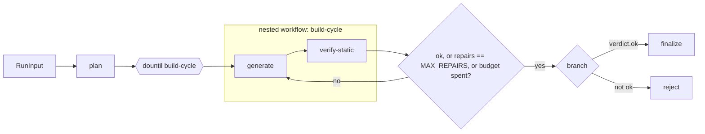
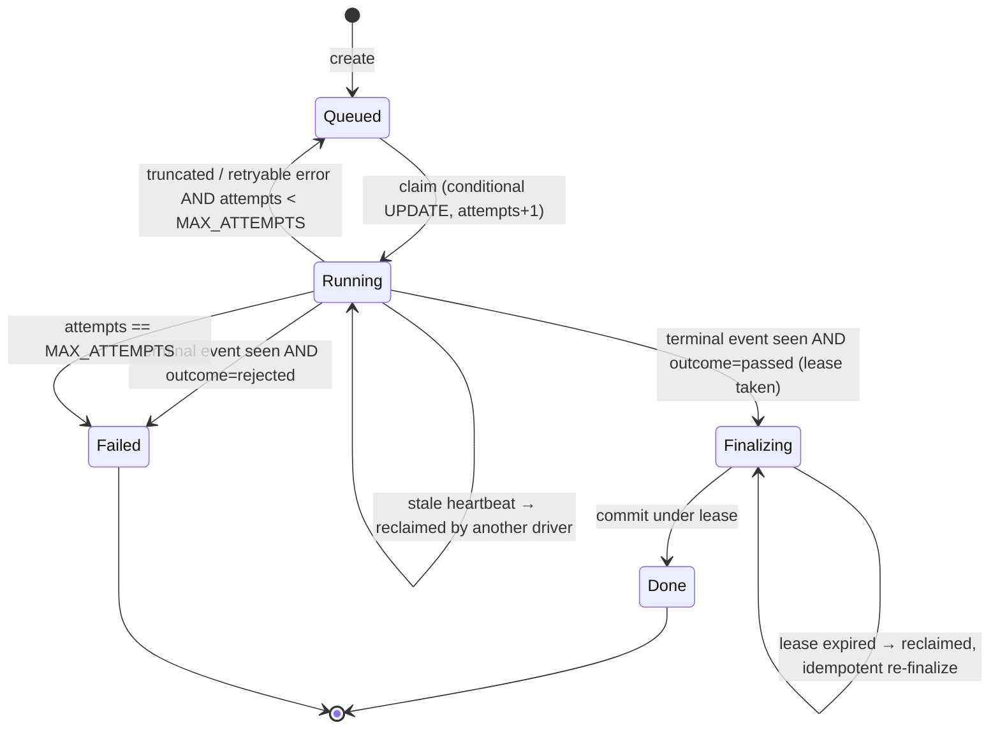

# cartridge: build contract

Status: accepted for build. Date: 2026-09-24. Owner: Pyae Sone (Seon).

This document is the only build contract for the engine. If code and this spec disagree, one of them gets fixed in the same commit. Section numbers (§) are stable; tests and commits cite them.

**Product in one line:** an agentic generator for single-file HTML5 mini-games. It is built as an explicit workflow graph, and its output is checked by a two-tier evaluator: free static rules first, then a headless runtime probe.

**Honesty line (README line 1, verbatim):** "Independent reimplementation. Contains no client code, prompts, data or assets."

Nothing in this repo says "production" or "shipped". The live page is labelled a replay of recorded model calls.

---

## 0. Ground rules

| Rule         | Consequence                                                                                                                                                                                                                                                                                                                                                                      |
| ------------ | -------------------------------------------------------------------------------------------------------------------------------------------------------------------------------------------------------------------------------------------------------------------------------------------------------------------------------------------------------------------------------- |
| Clean room   | Every game type, event name, card, rule text, prompt, dataset item and threshold here is newly authored. `npm run check:clean-room` scans the tree for a hashed denylist of client terms (§12.3).                                                                                                                                                                                |
| Runtime      | Node 24.x (`"engines": { "node": "24.x" }`), ESM (`"type": "module"`), a single package with no workspaces.                                                                                                                                                                                                                                                                      |
| TypeScript   | `strict`, `noUncheckedIndexedAccess`, `exactOptionalPropertyTypes`, `verbatimModuleSyntax`, `erasableSyntaxOnly`, `allowImportingTsExtensions`, `noEmit`. Relative imports carry the `.ts` extension so that `node file.ts` runs without a build step. No enums, namespaces or constructor parameter properties (Node strip-only rejects them; see research `mastra-api.md` §0). |
| Dependencies | Exact versions only (no `^`/`~`). Before any library API is used, it is checked against the installed `.d.ts` or context7 docs. Starting pins are in §13.1.                                                                                                                                                                                                                      |
| Schemas      | Zod 4 at every boundary: tool I/O, step I/O, cassettes, dataset, reports, SSE events, run rows.                                                                                                                                                                                                                                                                                  |
| Tests        | Vitest, test-first. Coverage ≥ 80 % lines on `src/engine/**` and `src/eval/**`, enforced by `vitest.config.ts` thresholds.                                                                                                                                                                                                                                                       |
| Code shape   | Functions ≤ 30 lines where practical, JSDoc on every export, guard clauses, max nesting 3, named constants (no magic numbers), no TODO comments.                                                                                                                                                                                                                                 |
| Secrets      | `ANTHROPIC_API_KEY` lives only in a git-ignored `.env`. No public endpoint can reach a live model (§8.5). gitleaks runs in CI.                                                                                                                                                                                                                                                   |
| Git          | Conventional commits, files added by name, one commit per slice step or more. No AI attribution lines. Never push or deploy without Seon's explicit approval.                                                                                                                                                                                                                    |

---

## 1. Repo layout

Single package. The Vercel project root is the repo root. Functions in `api/` import `../src/...` by relative path (no path aliases; Vercel does not honour them).

```
cartridge/
  package.json  tsconfig.json  vitest.config.ts  eslint.config.js  vercel.json  .env.example
  README.md  CHANGELOG.md  LICENSE
  docs/
    SPEC.md                     this file
    adr/0001-explicit-workflow-graph.md
    adr/0002-two-tier-evaluator.md
    adr/0003-cassette-replay-demo.md
    research/*.md               API and platform notes (verified 2026-09-24)
  src/
    contract/
      bridge.ts                 Zod schemas for game→host and host→game messages (§2.1)
      game-types.ts             GAME_TYPES + per-type rule table (§2.2)
      spec.ts                   GameSpec schema (§4.2)
      index.ts
    cards/
      *.md                      12 knowledge cards (§3)
      index.ts                  loader: parse front matter, index lines, resolve rule anchors
    engine/
      mastra.ts                 createCartridge(deps) → { mastra, workflow }
      workflow.ts               the graph (§4.1)
      steps/plan.ts  steps/generate.ts  steps/verify-static.ts  steps/finalize.ts  steps/reject.ts
      tools/list-cards.ts  tools/get-card.ts  tools/read-latest.ts  tools/write-version.ts  tools/verify.ts
      prompts/planner.md  prompts/builder.md
      budgets.ts                every engine limit as a named constant (§4.4)
      artifacts/{types,memory,fs}.ts     versioned artifact store (§4.3)
      run-store/{types,memory,libsql}.ts run table + event log (§5.3)
      lifecycle.ts              state machine transitions (§5)
      driver.ts                 claims a run, drives the workflow stream, finalizes (§5.4)
      relay.ts                  SSE relay (§6)
      attribution.ts            failure attribution (§4.5)
    models/
      port.ts                   ModelPort factory (§7.1)
      anthropic.ts              live provider (@ai-sdk/anthropic)
      cassette.ts               record / replay fetch layer (§7.2)
      cassette-format.ts        Zod schema for cassette files
      request-key.ts            canonical JSON + sha256 key
      mock.ts                   test helpers around MockLanguageModelV4
    eval/
      e1/                       contract scorer: rules/*.ts, scan.ts (payload parser), score.ts (§2.3)
      e2/                       runtime probe: probe.ts, host.html, instrument.ts, metrics.ts, detectors.ts, thresholds.ts, bot.ts (§8)
      e3/                       cited categorical judge: rubric.ts, validate.ts, judge.ts (§10.1)
      e4/                       language match: detect.ts, extract-ui-strings.ts, words-en.ts, words-fr.ts (§10.2)
      dataset/schema.ts  dataset/privacy-guard.ts (§11.1)
      tiers.ts                  smoke1 / smoke / full (§11.2)
      pricing.ts                versioned price table (§11.4)
      report/{aggregate,markdown,json}.ts (§11.3)
      matrix.ts                 detection matrix check (§9.2)
      cli.ts                    `run`, `score`, `matrix` subcommands (§12)
    server/
      dev.ts                    node:http dev server that mounts the same handlers as api/
      handlers.ts               Web Request → Response handlers shared by dev server and api/
  fixtures/
    known-bad/*.html  known-bad/manifest.json    hand-authored games (§9.1)
    good/*.html                                  one control game per game type
  dataset/prompts.v1.json       20 authored prompts (§11.1)
  cassettes/<item-or-demo-id>/<key>.json         recorded model calls (§7.3)
  games/<item-id>/a<n>.html  games/<item-id>/manifest.json  games/<item-id>/run.json  games/<item-id>/e2.json
  reports/<tier>/<label>/report.md  report.json  reports/committed/<tier>.json  reports/committed/matrix.json
  api/
    prompts.ts                  GET  /api/prompts
    replay.ts                   GET  /api/replay?promptId=…  (SSE, replay-only)
  site/                         project page, built later in the /polish pass
  scripts/
    clean-room-scan.ts          hashed denylist scan (§12.3)
    record-demo.ts              records demo cassettes with a live key (local only)
```

`games/`, `cassettes/` and `reports/committed/` are committed, so CI and the demo need no key. Each is written **the moment it exists** during a run (persist-first rule), never batched at the end.

---

## 2. Game contract

### 2.1 Bridge protocol (postMessage)

The game is one HTML file that runs inside `<iframe sandbox="allow-scripts" srcdoc=…>`. It has no same-origin, so storage APIs throw. Games talk to the host only through `postMessage`.

**Canonical helper.** Card `bridge` defines it, and every game includes it verbatim:

```js
const CARTRIDGE = {
  send(type, payload = {}) {
    window.parent.postMessage(
      { source: "cartridge", v: 1, type, payload },
      "*",
    );
  },
};
```

**Game → host events.** Zod schema `GameEvent` in `src/contract/bridge.ts` is a discriminated union on `type`:

| Event   | Payload                                               | When                                                            |
| ------- | ----------------------------------------------------- | --------------------------------------------------------------- |
| `boot`  | `{ title: string; gameType: GameType; lang: string }` | once, as soon as the first frame is drawn                       |
| `start` | `{}`                                                  | when play begins (first tap, or immediately for `toy-box`)      |
| `score` | `{ value: number }` (integer ≥ 0)                     | whenever the score changes                                      |
| `level` | `{ index: number }` (integer ≥ 1)                     | on entering a level; the first is `1` and each next one is `+1` |
| `end`   | `{ reason: EndReason; value?: number }`               | once per play-through                                           |

`EndReason = "lose" | "win" | "stuck"`. Envelope: `{ source: "cartridge", v: 1, type, payload }`. Anything with a different `source` is ignored by the host.

**Host → game commands.** Envelope `{ source: "cartridge-host", type }`, with `type ∈ { "pause", "resume", "reset" }`. `reset` must bring the game back to its pre-`start` state without reloading the page.

### 2.2 Game types and rule table

`GAME_TYPES = ["arcade-run", "stage-clear", "puzzle-board", "toy-box"] as const`.

| gameType       | Idea                                          | `score`   | `level`   | `end`     | allowed `end.reason` | E2 idle-death gate                                             | E2 idle motion required    |
| -------------- | --------------------------------------------- | --------- | --------- | --------- | -------------------- | -------------------------------------------------------------- | -------------------------- |
| `arcade-run`   | continuous run, one life, survive and collect | required  | forbidden | required  | `lose`               | yes: `end` before `IDLE_DEATH_MIN_SECONDS` after `start` fails | yes                        |
| `stage-clear`  | discrete stages, each with a goal             | optional  | required  | required  | `win`, `lose`        | yes: same                                                      | yes                        |
| `puzzle-board` | turn-based board, no clock pressure           | required  | optional  | required  | `win`, `stuck`       | stricter: **any** `end` during the idle window fails           | no (a still board is fine) |
| `toy-box`      | open play, no goal and no failure             | forbidden | forbidden | forbidden | —                    | any `end` fails                                                | no                         |

This table lives in exactly one place (`src/contract/game-types.ts`) as `GAME_TYPE_RULES: Record<GameType, TypeRules>`. E1, E2 and the cards read from it. A test checks that each type card's table matches it.

### 2.3 E1 rule list (the contract scorer)

E1 is a set of pure, deterministic functions `(html: string, ctx: { spec?: GameSpec }) → RuleResult`. There is no I/O.

- **Severity:** `hard` rules are gating, `soft` rules are scored but not gating, and `metric` rules are reported and never scored.
- **Score:** `passed / applicable` over hard and soft rules. A rule that does not apply to the declared type is `n/a` and leaves the denominator.
- **Verdict:** `ok = (hard failures === 0)`. The `verify` tool and the verify-static step use this same verdict (§4).
- **Fix hints:** each rule carries a prescriptive `fix` string (for example "Emit `CARTRIDGE.send("start")` when play begins"). This string is exactly what the repair prompt receives.
- **Citations:** each rule declares `{ card, anchor }`. The anchor is an HTML comment `<!-- rule:E1-nn -->` at the end of the card line that states the rule. The loader resolves it to `cards/<card>.md:<line>`, and reports print that form. A test fails if any rule has zero anchors or more than one, or if an anchor names an unknown rule. Line numbers are therefore always computed and never typed by hand.
- **Payload scan:** call sites are found with `CARTRIDGE.send("<type>"` and the payload object literal is extracted by a balanced-brace scanner that knows about strings, template literals and comments (`src/eval/e1/scan.ts`). HUD text such as `"Score: 0"` in a string is never mistaken for a payload key.
- **Syntax check:** each classic inline `<script>` is compiled with `new vm.Script(source, { filename })` and never executed. `type="module"` scripts are forbidden by the contract (E1-09), so no subprocess and no timeout are needed.

| id    | sev    | card       | checks                                                                                                                             |
| ----- | ------ | ---------- | ---------------------------------------------------------------------------------------------------------------------------------- |
| E1-01 | hard   | game-page  | exactly one `<!doctype html>`, one `<html>…</html>`, and no nested `<iframe>`                                                      |
| E1-02 | hard   | game-page  | no external references: no `http(s):` or `//` URL in `src`, `href`, CSS `url()`, `@import` or `import()`; `data:` URIs are allowed |
| E1-03 | hard   | game-page  | `<html lang>` is present and is a well-formed BCP-47 tag (primary subtag of 2–3 letters, optional region)                          |
| E1-04 | soft   | game-page  | `<meta name="viewport">` includes `width=device-width`                                                                             |
| E1-05 | hard   | game-page  | no network APIs: `fetch(`, `XMLHttpRequest`, `WebSocket`, `EventSource`, `sendBeacon`                                              |
| E1-06 | hard   | game-page  | no persistence APIs: `localStorage`, `sessionStorage`, `indexedDB`, `document.cookie`                                              |
| E1-07 | hard   | game-page  | no dynamic code: `eval(`, `new Function(`, and `setTimeout`/`setInterval` with a string argument                                   |
| E1-08 | soft   | game-page  | no blocking dialogs: `alert(`, `confirm(`, `prompt(`                                                                               |
| E1-09 | hard   | game-page  | every inline script is classic (no `type="module"`) and compiles under `vm.Script`                                                 |
| E1-10 | hard   | bridge     | the `CARTRIDGE` helper is defined with `source: "cartridge"` and `v: 1`                                                            |
| E1-11 | hard   | bridge     | `boot` is emitted with the payload keys `title`, `gameType`, `lang`                                                                |
| E1-12 | soft   | bridge     | if `boot.lang` is a string literal, it equals `<html lang>`                                                                        |
| E1-13 | hard   | bridge     | `start` is emitted                                                                                                                 |
| E1-14 | hard   | bridge     | `boot.gameType` is a string literal in `GAME_TYPES` (and equals `spec.gameType` when a spec is given)                              |
| E1-15 | hard   | type card  | every event that is _required_ for the declared type has at least one call site                                                    |
| E1-16 | hard   | type card  | no event that is _forbidden_ for the declared type has a call site                                                                 |
| E1-17 | soft   | type card  | every string-literal `end.reason` is in the type's allowed set                                                                     |
| E1-18 | soft   | bridge     | the `score.value` payload is not a string literal                                                                                  |
| E1-19 | soft   | bridge     | the `level` payload has an `index` key                                                                                             |
| E1-20 | soft   | bridge     | the game listens for `message` events and handles `pause` and `resume` from `source: "cartridge-host"`                             |
| E1-21 | soft   | bridge     | the game handles the `reset` command                                                                                               |
| E1-22 | soft   | input card | pointer input is registered (`pointerdown`, `pointerup`, `pointermove` or `touchstart`)                                            |
| E1-23 | soft   | game-page  | the layout adapts to the viewport (a `resize` listener, or `innerWidth`/`innerHeight`, or `dvh`/`vw` units)                        |
| M-01  | metric | —          | document size in bytes                                                                                                             |
| M-02  | metric | —          | number of inline scripts                                                                                                           |
| M-03  | metric | —          | call-site count per bridge event                                                                                                   |
| M-04  | metric | —          | visible UI string count (input to E4)                                                                                              |

"type card" means the card for the declared game type (`arcade-run` and so on). "input card" means the card for `spec.input` when a spec is given, otherwise `tap-anywhere`.

---

## 3. Knowledge cards

There are 12 original markdown cards in `src/cards/`. Each has front matter (`id`, `kind`, `title`, `summary`, `related: string[]`), and its body is short (≤ 60 lines) and prescriptive.

| kind         | ids                                                    |
| ------------ | ------------------------------------------------------ |
| contract (2) | `game-page`, `bridge`                                  |
| type (4)     | `arcade-run`, `stage-clear`, `puzzle-board`, `toy-box` |
| input (3)    | `tap-anywhere`, `drag-follow`, `swipe-lanes`           |
| style (3)    | `paper-cut`, `chalkboard`, `risograph`                 |

- **Card requirements:** each type card restates its row of the §2.2 table and includes a minimal loop skeleton. Each style card gives a 4-colour palette, the drawing primitives to use, and what to avoid. All art is drawn in code, and each input card gives the pointer-event wiring.
- **Loader:** `src/cards/index.ts` exports `listCards()` (sorted by id), `getCard(id)` → `{ id, kind, title, body, lines: string[] }`, and `resolveAnchor(ruleId)` → `{ card, line }`.
- **Deterministic retrieval:** cards are always returned sorted by id and serialised with stable key order, so the prompt prefix is byte-stable across runs (this also enables prompt caching; see research `deploy-and-models.md` §2.4).
- **Out of scope:** an MCP server for the cards. Cards reach the model through typed tools only (§4.3).

---

## 4. Workflow graph

### 4.1 Shape and Mastra constructs

Verified constructs (`@mastra/core` 1.70.0, research `mastra-api.md` §1): `createWorkflow`, `createStep`, `.then`, `.dountil(step, cond)` (the condition receives `iterationCount`), `.branch([[cond, step], …])`, `.commit()`, `writer.custom({ type: "data-…" })`, and `run.stream()` → `fullStream` + `result`.



```ts
const buildCycle = createWorkflow({
  id: "build-cycle",
  inputSchema: BuildState,
  outputSchema: BuildState,
})
  .then(generateStep)
  .then(verifyStaticStep)
  .commit();

export const cartridgeWorkflow = createWorkflow({
  id: "cartridge-run",
  inputSchema: RunInput,
  outputSchema: RunOutput,
})
  .then(planStep) // RunInput → BuildState (attempt 0, verdict null)
  .dountil(buildCycle, async ({ inputData }) => shouldStopBuilding(inputData))
  .branch([
    [async ({ inputData }) => inputData.verdict?.ok === true, finalizeStep],
    [async ({ inputData }) => inputData.verdict?.ok !== true, rejectStep],
  ])
  .commit();
```

- **Why the loop is shaped this way:** `.dountil` always runs its body at least once. That matches our semantics: the first pass through `build-cycle` is the initial generation (attempt 0), and every later pass is a repair. There is never an empty repair pass.
- **Stop rule:** `shouldStopBuilding(s) = s.verdict?.ok === true || s.repairs >= MAX_REPAIRS || s.repairTokens >= REPAIR_TOKEN_BUDGET || s.runTokens >= RUN_TOKEN_BUDGET`. It is a pure function with its own unit tests. The iteration cap comes from `repairs`, not from `iterationCount`, so the rule can be tested without Mastra.
- **Branch output:** `.branch` output is keyed by step id (`{ finalize: … }` or `{ reject: … }`). `RunOutput = z.object({ finalize: FinalizeOut.optional(), reject: RejectOut.optional() })`.
- **S2 verification item:** confirm that a nested workflow type-checks as a `.dountil` body under strict mode. **Fallback, if it doesn't:** a single `build-cycle` step whose `execute` calls `runGenerate()` then `runVerify()` (plain functions exported from the two step modules) and emits the same `data-cartridge` progress events. Step I/O and attribution stay the same.

### 4.2 Typed step I/O (Zod, in `src/engine/workflow.ts` unless noted)

```ts
RunInput   = { runKey: string /* dataset item id or demo id; never a random id */, prompt: string }
GameSpec   = { title: string /*≤48*/, slug: /^[a-z0-9]+(-[a-z0-9]+)*$/ /*≤40*/, lang: "en" | "fr",
               gameType: GameType, loop: string /*≤280*/, input: InputCardId, style: StyleCardId }   // src/contract/spec.ts
Finding    = { ruleId: string, severity: "hard" | "soft", message: string, fix: string, citation: string }
Verdict    = { ok: boolean, score: number, errors: Finding[], warnings: Finding[] }
Usage      = { input: number, output: number, cacheRead: number, cacheWrite: number }
AttemptRec = { attempt: number, mode: "initial" | "repair", artifact: ArtifactRef | null,
               verdict: Verdict | null, usage: Usage, repairOf: string[] /* rule ids that caused it */ }
BuildState = { runKey, prompt, spec: GameSpec, attempt: number, repairs: number,
               artifact: ArtifactRef | null, verdict: Verdict | null,
               runTokens: number, repairTokens: number, history: AttemptRec[] }
FinalizeOut = { outcome: "passed", artifact: ArtifactRef, verdict: Verdict, history: AttemptRec[] }
RejectOut   = { outcome: "rejected", attribution: Attribution, history: AttemptRec[] }
```

| step            | in → out                   | what it does                                                                                                                                                                                                                                                                                                                                                                                                                                                                                                                                                                                                               |
| --------------- | -------------------------- | -------------------------------------------------------------------------------------------------------------------------------------------------------------------------------------------------------------------------------------------------------------------------------------------------------------------------------------------------------------------------------------------------------------------------------------------------------------------------------------------------------------------------------------------------------------------------------------------------------------------------- |
| `plan`          | `RunInput → BuildState`    | Detects the prompt language **in code** with the E4 detector (§10.2). This is the "decided once" rule: the value is written into `spec.lang` and never re-decided. Then it calls agent `planner` (tools `list_cards`, `get_card`) with `structuredOutput: { schema: GameSpec }`. It overwrites `spec.lang` with the code decision, and emits `data-cartridge {phase:"plan"}`.                                                                                                                                                                                                                                              |
| `generate`      | `BuildState → BuildState`  | Loads the 5 cards named by the spec (`game-page`, `bridge`, the type, the input, the style) in id order. It calls agent `builder` (tools `get_card`, `read_latest`, `write_version`) with `maxSteps: GENERATE_MAX_STEPS`. In repair mode the prompt holds the previous attempt's `errors[]` as `ruleId + message + fix` lines, plus the instruction to `read_latest` first. **The artifact is taken from the artifact store for `(runKey, attempt)`, never from model text.** If nothing was written, the attempt records `artifact: null` and code `generate-no-artifact`. It adds up `totalUsage` from the agent result. |
| `verify-static` | `BuildState → BuildState`  | Runs the `verify` tool (E1 hard + soft) on the artifact, stores the `Verdict`, increments `attempt`, and increments `repairs` when the next pass will be a repair. It emits `data-cartridge {phase:"verify", score, errors:[ruleId]}`.                                                                                                                                                                                                                                                                                                                                                                                     |
| `finalize`      | `BuildState → FinalizeOut` | A pure packaging step. Committing the result to the run row is the driver's job, under the lease (§5.4).                                                                                                                                                                                                                                                                                                                                                                                                                                                                                                                   |
| `reject`        | `BuildState → RejectOut`   | Builds the `Attribution` (§4.5).                                                                                                                                                                                                                                                                                                                                                                                                                                                                                                                                                                                           |

Prompts (`src/engine/prompts/*.md`) are newly authored. They contain no run id, timestamp or other volatile value, so cassette keys and prompt-cache prefixes are stable (§7.2).

### 4.3 Tools (Mastra `createTool`, Zod I/O)

The tool name the model sees is the **object key**, so keys equal ids (`tools: { write_version: writeVersion }`). No generic file or shell tool exists.

| tool            | input                                   | output                                                | notes                                                                                                                                         |
| --------------- | --------------------------------------- | ----------------------------------------------------- | --------------------------------------------------------------------------------------------------------------------------------------------- |
| `list_cards`    | `{ kind?: CardKind }`                   | `{ cards: { id, kind, title, summary }[] }`           | sorted by id                                                                                                                                  |
| `get_card`      | `{ id: CardId }`                        | `{ id, body }`                                        | unknown id → a Zod error the model sees                                                                                                       |
| `read_latest`   | `{}`                                    | `{ found: boolean, version?: string, html?: string }` | the scope `(runKey)` comes from `requestContext`, never from model input                                                                      |
| `write_version` | `{ html: string /*≤ MAX_GAME_BYTES*/ }` | `{ version: "a<n>", bytes, sha256 }`                  | idempotent per `(runKey, attempt)`: a second write in the same attempt overwrites it. The result has no run id, so replays are byte-identical |
| `verify`        | `{ html: string }`                      | `Verdict`                                             | the E1 scorer. Used by the `verify-static` step and **not** given to the builder agent, so the repair loop stays explicit and attributable    |

`ArtifactStore` interface: `put(runKey, attempt, html) → ArtifactRef`, `latest(runKey)`, `get(ref)`. There are two implementations:

- `MemoryArtifactStore`: for Vercel and tests.
- `FsArtifactStore`: writes `games/<runKey>/a<n>.html` plus `manifest.json`, which is the ordered list of versions with sha256. Each file is written the moment `put` returns.

### 4.4 Budgets (`src/engine/budgets.ts`)

| constant              | value   | meaning                                              |
| --------------------- | ------- | ---------------------------------------------------- |
| `MAX_REPAIRS`         | 3       | repair passes after the initial generation           |
| `GENERATE_MAX_STEPS`  | 6       | agent steps inside one `generate` call               |
| `PLAN_MAX_STEPS`      | 4       | agent steps inside `plan`                            |
| `REPAIR_TOKEN_BUDGET` | 300_000 | total tokens (input + output) spent in repair passes |
| `RUN_TOKEN_BUDGET`    | 520_000 | total tokens for the whole run                       |
| `MAX_GAME_BYTES`      | 120_000 | upper bound on one HTML artifact                     |

Token counts come from our own sum of each agent call's `totalUsage`. Mastra's workflow-level usage read zero in the probe (research `mastra-api.md` §4), so it is never trusted.

### 4.5 Failure attribution (`src/engine/attribution.ts`)

`Attribution = { step: "plan" | "generate" | "verify-static" | "finalize" | "driver", code: FailureCode, attempt: number, ruleIds: string[], message: string, retryable: boolean }`

| code                   | step            | retryable | source                                                                                                                                                                                                     |
| ---------------------- | --------------- | --------- | ---------------------------------------------------------------------------------------------------------------------------------------------------------------------------------------------------------- |
| `plan-invalid-spec`    | plan            | no        | the structured output failed `GameSpec`                                                                                                                                                                    |
| `generate-no-artifact` | generate        | no        | the final attempt wrote nothing                                                                                                                                                                            |
| `contract-unmet`       | **generate**    | no        | repairs were exhausted with hard failures. The blame goes to the step that _produced_ the artifact, and `ruleIds` are the remaining hard failures. verify-static detected the problem; it did not cause it |
| `budget-exhausted`     | generate        | no        | a token budget was hit before `ok`                                                                                                                                                                         |
| `verifier-crashed`     | verify-static   | no        | an exception inside E1 (a harness bug)                                                                                                                                                                     |
| `model-refusal`        | plan / generate | no        | the provider finish reason is refusal or content-filter                                                                                                                                                    |
| `model-error`          | plan / generate | yes       | a provider 5xx, overload or network error                                                                                                                                                                  |
| `cassette-miss`        | plan / generate | no        | replay mode, no recording for this request key                                                                                                                                                             |
| `truncated-stream`     | driver          | yes       | the stream ended without `workflow-finish` (§5.2)                                                                                                                                                          |
| `lease-lost`           | driver          | yes       | the conditional finalize update matched 0 rows                                                                                                                                                             |

- **Thrown step errors:** mapped from `result.steps[stepId].status === "failed"` (Mastra marks the failing step and leaves the earlier ones as `success`), combined with our own `history`.
- **Test:** each code has a test that forces it (a mock model or an injected fault) and asserts `{ step, code }`.

---

## 5. Run lifecycle

### 5.1 States



| constant                | value  |
| ----------------------- | ------ |
| `MAX_ATTEMPTS`          | 3      |
| `HEARTBEAT_INTERVAL_MS` | 20_000 |
| `STALE_RUNNING_MS`      | 75_000 |
| `FINALIZE_LEASE_MS`     | 30_000 |

### 5.2 Invariants (each one has a test)

1. **Single winner.** A claim is one conditional update: `UPDATE runs SET status='Running', attempts=attempts+1, owner=?, heartbeat_at=? WHERE id=? AND attempts < max_attempts AND (status='Queued' OR (status='Running' AND heartbeat_at < ?) OR (status='Finalizing' AND lease_until < ?))`. The caller wins only if `rowsAffected === 1`. Test: two concurrent claims on one store produce exactly one winner.
2. **Never finalize without a terminal event.** The driver moves to `Finalizing` only after it has consumed a `workflow-finish` chunk with `workflowStatus: "success"` **and** found `finalize` in the branch output. A stream that closes without `workflow-finish` counts as `truncated-stream`. Test: a mock stream cut short leaves the run `Queued` (or `Failed` at the cap), never `Done`.
3. **Finalize under lease.** `Running → Finalizing` sets `lease_owner`, `lease_until`. `Finalizing → Done` is conditional on `status='Finalizing' AND lease_owner=?`. Finalize is idempotent: re-committing the same `artifact.sha256` is a no-op.
4. **Retries only for retryable failures.** Deterministic failures (`contract-unmet`, `cassette-miss`, `model-refusal` and the rest in §4.5) go straight to `Failed`. Retrying them would spend again for a different game.
5. **Eval runs use `MAX_ATTEMPTS_EVAL = 1`**, so each dataset item's cost and outcome belongs to exactly one generation.
6. **Terminal state lives on the row only.** `Done` and `Failed` are read from the run row, never inferred from the stream (§6).

### 5.3 Store interface (`src/engine/run-store/types.ts`)

```ts
interface RunStore {
  create(input: {
    id: string;
    runKey: string;
    prompt: string;
    maxAttempts: number;
  }): Promise<RunRow>;
  get(id: string): Promise<RunRow | null>;
  claim(id: string, owner: string, now: number): Promise<boolean>;
  heartbeat(id: string, owner: string, now: number): Promise<boolean>;
  beginFinalize(id: string, owner: string, now: number): Promise<boolean>;
  completeFinalize(
    id: string,
    owner: string,
    result: DoneResult,
  ): Promise<boolean>;
  fail(id: string, owner: string, attribution: Attribution): Promise<boolean>;
  release(
    id: string,
    owner: string,
    attribution: Attribution,
  ): Promise<boolean>; // back to Queued
  appendEvent(id: string, event: ProgressEvent): Promise<number>; // returns seq
  listEvents(id: string, afterSeq: number): Promise<StoredEvent[]>;
}
```

- **`RunRow`:** `{ id, runKey, prompt, status, attempts, maxAttempts, owner, heartbeatAt, leaseOwner, leaseUntil, spec, artifact, e1Score, attribution, createdAt, updatedAt }`.
- **`MemoryRunStore`:** a `Map`. Each method runs its check and write synchronously inside one call, so there is no `await` between the check and the write.
- **`LibSqlRunStore`:** `@libsql/client`, with tables `runs` and `run_events(run_id, seq, type, data_json, at, PRIMARY KEY(run_id, seq))`. Every transition is one `UPDATE … WHERE` statement. The URL comes from `CARTRIDGE_DB_URL` (default `file:.data/cartridge.db`, absolute-resolved).
- **Shared tests:** one contract test suite (`run-store.contract.test.ts`) runs against both implementations. It uses an injected `Clock` (`{ now(): number }`), so tests never sleep.
- **Mastra's own storage:** `InMemoryStore` everywhere. Mastra snapshots are not our run table, and `options.autoRestartActiveRuns: false` is set because the driver owns recovery.

### 5.4 Driver (`src/engine/driver.ts`)

`driveRun(runId, deps)`:

1. Claim the run, or return.
2. Build a `RequestContext` with `runKey` and `attempt`.
3. `run.stream(...)`.
4. For each chunk, map it to a `ProgressEvent` and `appendEvent`. Heartbeat on an interval.
5. At the end of the stream, apply §5.2 (2).
6. Then run `beginFinalize → completeFinalize`, `fail` or `release`.

The local dev server runs drivers in-process through a small queue (`DRIVER_CONCURRENCY = 2`). No external queue is needed.

---

## 6. SSE relay

### 6.1 Wire format

```
id: <seq>
event: progress | terminal | reconnect
data: <JSON, one line>

: ping            (comment heartbeat every RELAY_HEARTBEAT_MS)
```

`ProgressEvent` is a discriminated union on `kind`, persisted in `run_events`:

| kind             | data                                       | source                                      |
| ---------------- | ------------------------------------------ | ------------------------------------------- |
| `run.claimed`    | `{ attempt }`                              | driver                                      |
| `step.start`     | `{ step, attempt }`                        | `workflow-step-start`                       |
| `step.result`    | `{ step, attempt, status }`                | `workflow-step-result`                      |
| `plan.spec`      | `{ spec }`                                 | `data-cartridge`                            |
| `tool.call`      | `{ step, tool }`                           | `data-cartridge` (emitted by tool wrappers) |
| `verify.verdict` | `{ attempt, ok, score, errors: string[] }` | `data-cartridge`                            |
| `repair.start`   | `{ attempt, fromRules: string[] }`         | `data-cartridge`                            |
| `usage`          | `{ step, attempt, usage }`                 | `data-cartridge`                            |
| `run.released`   | `{ attribution }`                          | driver                                      |

`TerminalEvent` (`event: terminal`) is `{ status: "Done" | "Failed", artifact?: { version, sha256, html }, e1Score?, attribution? }`. **It is built only from the run row**, after the relay reads a row whose status is `Done` or `Failed`. The workflow stream never produces it.

### 6.2 Behaviour (`src/engine/relay.ts`)

- On connect, read `Last-Event-ID` (or `?after=`). Send stored events with `seq > after`, then tail the store every `RELAY_POLL_MS`.
- As soon as the row is terminal and every stored event has been sent, send `terminal` (its id is `last seq + 1`) and close.
- Send the heartbeat comment every `RELAY_HEARTBEAT_MS`. Before `RELAY_BUDGET_MS`, send `event: reconnect` and close, and let `EventSource` re-attach with `Last-Event-ID`.
- A client that attaches after `Done` receives the full log plus `terminal`. That is the same answer a client connected from the start got.

| constant             | value                                    |
| -------------------- | ---------------------------------------- |
| `RELAY_POLL_MS`      | 200                                      |
| `RELAY_HEARTBEAT_MS` | 12_000                                   |
| `RELAY_BUDGET_MS`    | 270_000 (below Vercel Hobby's 300 s cap) |

### 6.3 Endpoints

| route                       | where           | behaviour                                                                                        |
| --------------------------- | --------------- | ------------------------------------------------------------------------------------------------ |
| `POST /runs`                | dev server only | `{ prompt, promptId? }` → `202 { runId }`. It writes a `Queued` row, then enqueues it            |
| `GET /runs/:id/events`      | dev server only | the relay (§6.2) over `LibSqlRunStore`                                                           |
| `GET /api/prompts`          | dev + Vercel    | the demo prompt list: `{ id, prompt, lang, stratum }[]` for the prompts that have a cassette set |
| `GET /api/replay?promptId=` | dev + Vercel    | **single-invocation replay**. See below                                                          |

How `/api/replay` works:

- It creates the run in a fresh `MemoryRunStore`, runs the real driver and workflow with the model hard-wired to `replay` mode, and relays over the same store within one invocation. On Vercel, separate invocations may land on different instances, so a request/relay split would lose in-memory state.
- **Re-attach:** replay is deterministic, so a reconnect with `Last-Event-ID: n` re-runs the replay with `REPLAY_PACE=instant` and emits only `seq > n`. Test: two replays of the same prompt produce identical `(seq, kind, data)` sequences.
- **Pacing:** `?pace=recorded|fast` (default `fast`). `recorded` spaces events by the recorded inter-chunk gaps, capped at `REPLAY_MAX_GAP_MS = 1_500`.
- **The only thing canned is the model call.** Plan, tools, artifact store, E1 verify-static, the repair loop, the lifecycle and the relay all run for real.

---

## 7. Model layer

### 7.1 Port (`src/models/port.ts`)

```ts
type ModelRole = "planner" | "builder" | "judge";
type ModelMode = "live" | "record" | "replay" | "mock";
createModel(role: ModelRole, mode: ModelMode, opts: { cassetteDir?: string; mock?: MockScript }): MastraModelConfig
```

| role             | model id           |
| ---------------- | ------------------ |
| planner, builder | `claude-sonnet-5`  |
| judge            | `claude-haiku-4-5` |

- **Mode selection:** `CARTRIDGE_MODEL_MODE` picks the mode, and the default is `replay`. `live` and `record` need `ANTHROPIC_API_KEY` and throw at startup without it.
- **`anthropic.ts`:** `createAnthropic({ apiKey, fetch? })` from `@ai-sdk/anthropic` returns a `LanguageModelV4`, which Mastra accepts as `model` (research `mastra-api.md` §4, option B). The judge runs at `temperature: 0`. The builder and planner leave sampling at the defaults, because Sonnet 5 rejects non-default temperature. Determinism for the demo comes from cassettes, not from sampling.
- **`mock.ts`:** thin helpers around `MockLanguageModelV4` from `ai/test` (a devDependency), plus `scriptedTurns([...])`, which scripts tool-call and text turns for unit tests. `MockLanguageModelV3` from `ai@7` must not be used (it fails to type-check).

### 7.2 Cassette (`src/models/cassette.ts`)

- **Mechanism:** record and replay sit at the **HTTP fetch layer** of the Anthropic provider. `createAnthropic({ apiKey, fetch: cassetteFetch(mode, dir) })` works the same for streaming and non-streaming calls. The replayed bytes are exactly what the provider returned, including the `usage` block, so cost panels show real cache behaviour.
- **S2 verification item:** confirm in `node_modules/@ai-sdk/anthropic` types that the settings accept `fetch`. **Fallback:** a hand-rolled `CassetteModel implements LanguageModelV3` (`@ai-sdk/provider@3.0.14`, research §2.2), which records and replays stream parts instead of HTTP bodies. The file format keeps the same `key` and `request` fields, with `response.parts` in place of `response.body`.
- **Key:** `sha256(canonicalJson({ url: pathname, body: parsedRequestBody }))`, written as `sha256:<hex>`. Canonical JSON sorts keys recursively and drops `undefined` values. Headers are never part of the key and are **never stored**.
- **Volatile guard:** before hashing, `assertNoVolatile(body)` throws if it finds a UUID or an ISO timestamp anywhere in the body. This protects both replay determinism and prompt caching.
- **Modes:**
  - `record` calls the network, writes the cassette file immediately, and returns the response.
  - `replay` never touches the network. A missing key throws `CassetteMissError`, which maps to `cassette-miss`.
  - `live` passes through without recording.
- **Duplicate requests:** within one run, identical requests get an occurrence index (`key#1`, `key#2`) so that repeated identical calls replay in order.

### 7.3 Cassette file format (`cassette-format.ts`, Zod)

Path: `cassettes/<runKey>/<hex-key>[.<occurrence>].json`, plus `cassettes/<runKey>/index.json`, which lists the keys in call order.

```json
{
  "format": "cartridge-cassette/1",
  "key": "sha256:…",
  "occurrence": 0,
  "role": "builder",
  "model": "claude-sonnet-5",
  "request": { "url": "/v1/messages", "body": {} },
  "response": {
    "status": 200,
    "contentType": "text/event-stream",
    "body": "<raw response text>",
    "gapsMs": [0, 42, 38]
  },
  "usage": { "input": 0, "output": 0, "cacheRead": 0, "cacheWrite": 0 },
  "priceTableVersion": "2026-09-24"
}
```

- `gapsMs` records the per-chunk gaps for `pace=recorded`.
- `usage` is copied from the provider's own usage fields.
- CI secret scan: a test fails if any cassette contains `x-api-key`, `authorization` or an `sk-ant-` prefix.

---

## 8. E2 runtime probe (`src/eval/e2/`)

E2 uses Playwright Chromium and `pngjs`. It is not run on Vercel, where the page shows committed E2 results and says so.

### 8.1 Harness

- `host.html` embeds the game as `<iframe sandbox="allow-scripts" srcdoc=…>` at `PROBE_VIEWPORT = { width: 360, height: 640 }`. This matches the demo page's sandbox, so storage and same-origin mistakes surface here too.
- The host records every `message` with `source: "cartridge"` along with a `performance.now()` timestamp.
- **Instrumentation:** the probe prepends one `<script>` (`instrument.ts`) into the srcdoc. It is the only change made to the game. It forwards `error`, `unhandledrejection` and `console.error` to the host as `{ source: "cartridge-probe", kind, message }`. This avoids depending on Playwright surfacing errors from sandboxed child frames. S3 checks whether `page.on("pageerror")` also sees them and records the answer in `docs/research`.
- **Frames:** a frame is `iframe.screenshot()`, which captures composited pixels and works for DOM, 2D canvas and WebGL alike.
- **Metrics (`metrics.ts`, pure, tested with in-memory PNGs):**
  - luma stddev
  - distinct RGBA colour count
  - motion ratio: the share of pixels whose summed |ΔR|+|ΔG|+|ΔB| exceeds `MOTION_CHANNEL_DELTA_MIN`

### 8.2 Sequence and detectors

1. Load the host and wait for `boot` (≤ `BOOT_TIMEOUT_MS`).
2. Tap the centre (`START_TAP`) and wait for `start` (≤ `START_TIMEOUT_MS`). `toy-box` may already have sent it.
3. **Idle window:** from `start`, send no input for `IDLE_WINDOW_SECONDS`. Take frames A and B `FRAME_GAP_MS` apart early in the window, and log any `end` with its time since `start`.
4. `reset`, then `start` again. Tap and take frames before and after with `FRAME_GAP_MS`.
5. **Survival bot (reported only):** `SURVIVAL_TRIALS` trials, each up to `SURVIVAL_TRIAL_MAX_SECONDS`. The bot taps at intervals drawn from a PRNG seeded per item (`bot.ts`, mulberry32, seed = hash of the item id). It records `bestSurvivalSeconds = max(time to end)`, or the trial cap if the game never ended.

| detector id        | gate | fails when                                                                                                                                             | applies to                  |
| ------------------ | ---- | ------------------------------------------------------------------------------------------------------------------------------------------------------ | --------------------------- |
| `boot-handshake`   | hard | no valid `boot` within `BOOT_TIMEOUT_MS`, or the `boot` payload fails the Zod schema, or `boot.gameType`/`lang` differ from the static values          | all                         |
| `blank-frame`      | hard | frame A has `stddev < BLANK_LUMA_STDDEV_MIN` **or** `distinctColours < BLANK_DISTINCT_COLOURS_MIN`                                                     | all                         |
| `idle-static`      | hard | motion(A, B) `< IDLE_MOTION_RATIO_MIN`                                                                                                                 | `arcade-run`, `stage-clear` |
| `tap-unresponsive` | hard | motion(before tap, after tap) `< TAP_MOTION_RATIO_MIN`                                                                                                 | all                         |
| `idle-death`       | hard | `arcade-run`/`stage-clear`: `end` arrives less than `IDLE_DEATH_MIN_SECONDS` after `start`. `puzzle-board`/`toy-box`: any `end` inside the idle window | all                         |
| `console-error`    | hard | any forwarded `error`, `unhandledrejection` or `console.error`                                                                                         | all                         |

`bestSurvivalSeconds` is **reported only** and never gates. E2 passes when every applicable detector passes.

### 8.3 Thresholds (`thresholds.ts`)

These are the starting values. S3 tunes them on this repo's own `fixtures/good` and `fixtures/known-bad` and then freezes them. `docs/research/e2-calibration.md` records the measured metric for every fixture next to each threshold, so a reader can see the margin.

| constant                     | start value |
| ---------------------------- | ----------- |
| `PROBE_VIEWPORT`             | 360 × 640   |
| `BOOT_TIMEOUT_MS`            | 4_000       |
| `START_TIMEOUT_MS`           | 2_500       |
| `FRAME_GAP_MS`               | 180         |
| `BLANK_LUMA_STDDEV_MIN`      | 3.5         |
| `BLANK_DISTINCT_COLOURS_MIN` | 6           |
| `MOTION_CHANNEL_DELTA_MIN`   | 30          |
| `IDLE_MOTION_RATIO_MIN`      | 0.001       |
| `TAP_MOTION_RATIO_MIN`       | 0.002       |
| `IDLE_DEATH_MIN_SECONDS`     | 3           |
| `IDLE_WINDOW_SECONDS`        | 6           |
| `SURVIVAL_TRIALS`            | 3           |
| `SURVIVAL_TRIAL_MAX_SECONDS` | 25          |

Output file: `games/<id>/e2.json` = `{ detectors: Record<DetectorId, "pass" | "fail" | "n/a">, metrics: {...}, bestSurvivalSeconds, consoleErrors: string[] }`. It is written the moment the probe finishes.

---

## 9. "Static ≠ quality": known-bad fixtures and the detection matrix

### 9.1 Fixtures

Every fixture is hand-authored. It **scores E1 = 1.000 (all hard and soft rules pass)** and is built to trip exactly one E2 detector.

| fixture                                                                                        | gameType     | defect (runtime only)                                                        | expected detector  |
| ---------------------------------------------------------------------------------------------- | ------------ | ---------------------------------------------------------------------------- | ------------------ |
| `kb-01-dead-boot.html`                                                                         | arcade-run   | the `boot` call sits in a function that is never invoked                     | `boot-handshake`   |
| `kb-02-ink-on-ink.html`                                                                        | stage-clear  | draws every shape in the background colour                                   | `blank-frame`      |
| `kb-03-single-frame.html`                                                                      | arcade-run   | draws once, with no `requestAnimationFrame` loop                             | `idle-static`      |
| `kb-04-wrong-target.html`                                                                      | toy-box      | the pointer listener is attached to a zero-size element                      | `tap-unresponsive` |
| `kb-05-spawn-kill.html`                                                                        | arcade-run   | the first obstacle spawns on the player, so an idle player dies at about 1 s | `idle-death`       |
| `kb-06-late-throw.html`                                                                        | puzzle-board | a `TypeError` in the update loop about 600 ms after start                    | `console-error`    |
| `good-arcade-run.html`, `good-stage-clear.html`, `good-puzzle-board.html`, `good-toy-box.html` | each         | none                                                                         | none               |

`fixtures/known-bad/manifest.json` is Zod-validated: `{ id, file, gameType, expectedDetector, allowedCoFires: DetectorId[] }[]`. `allowedCoFires` is normally empty. Any entry must carry a one-line reason (for example: a single-frame game also looks unresponsive to taps).

### 9.2 Matrix check (`npm run eval:matrix`)

The check fails with exit 1 if any of these hold:

1. a fixture's E1 score is not exactly `1.000`;
2. a known-bad fixture does not trip its `expectedDetector`;
3. it trips a detector outside `{expectedDetector} ∪ allowedCoFires`;
4. a good control trips any detector;
5. **a registered detector is disabled or covered by no fixture.** Detectors live in a registry (`detectors.ts`: `{ id, enabled, run }[]`). The `--disable <id>` flag exists only to prove this check.

Test (`matrix.test.ts`, mutant-style): for each detector id, running the matrix with `--disable <id>` must exit 1. With nothing disabled it must exit 0.

The matrix writes `reports/committed/matrix.json` (verdicts only, sorted keys). CI re-runs it and diffs the verdicts. Raw metrics are excluded from the diff, because frame timing in headless Chromium is not byte-stable.

---

## 10. E3 judge and E4 language

### 10.1 E3: cited categorical judge (`src/eval/e3/`)

- **When it runs:** only with a key (`record`) or from committed cassettes (`replay`). It uses model `claude-haiku-4-5` at temperature 0 with structured output.
- **Input:** the prompt, the `GameSpec`, and the game HTML with 1-based line numbers prefixed.
- **Dimensions** (newly authored; categorical only; no numbers anywhere in the rubric):

| dimension                                                           | labels                              |
| ------------------------------------------------------------------- | ----------------------------------- |
| `asked-for-elements`                                                | `present`, `partial`, `absent`      |
| `type-fit`                                                          | `fits`, `strained`, `wrong`         |
| `first-contact` (can a player tell what to do without instructions) | `obvious`, `discoverable`, `opaque` |
| `look-consistency` (against the chosen style card)                  | `consistent`, `mixed`               |

- **Output schema:** `{ findings: { dimension, label, evidence: { line: number, quote: string }[], rationale: string }[] }`.
- **Validation (`validate.ts`, pure):** a finding is discarded when
  - `evidence` is empty;
  - `line` falls outside `[1, lineCount]`;
  - the whitespace-normalised `quote` (≥ `E3_MIN_QUOTE_CHARS = 6`) is not found on `line ± E3_LINE_TOLERANCE (1)`;
  - the rationale contains a numeric claim (`E3_NUMERIC_CLAIM` regex: a number followed by `%`, `/n`, "out of", "points", "fps" or "ms").
- **Null, not zero:** a dimension with no surviving finding is `null` (not measured), never the worst label. An unparseable response makes every dimension `null` and records `judgeError`.
- **Reports** show the label distribution and the null count per stratum. They never convert labels to numbers and never average them.

### 10.2 E4: language match (`src/eval/e4/`)

- **Detection:** `detectLanguage(text) → { lang: "en" | "fr" | "unknown", margin }` uses authored function-word lists (`words-en.ts`, `words-fr.ts`), matched on word boundaries. The `plan` step (§4.2) uses the same function, so the decision and the check come from one implementation.
- **UI string extraction:** text nodes outside `script`/`style`, plus the string literal arguments of `fillText(`, `strokeText(`, and of assignments to `textContent`, `innerText` and `innerHTML` (tags stripped).
- **Excluded from the evidence:** the slug, identifiers, CSS, numbers, and strings of ≤ 2 characters.
- **Abstention floor:** E4 abstains when there are fewer than `E4_MIN_STRINGS = 4` distinct strings, fewer than `E4_MIN_LETTERS = 30` letters, or the margin is below `E4_MIN_MARGIN = 2`.
- **Output:** `{ verdict: "match" | "mismatch" | "abstain", promptLang, uiLang, htmlLang, evidence: string[] }`. The score is 1, 0 or `null` respectively, and an abstention is never counted as a pass.

---

## 11. Dataset, tiers and reports

### 11.1 Dataset (`dataset/prompts.v1.json`)

Twenty prompts, all authored for this repo. None comes from real users or any client source.

| stratum       | rule                                                     | items | EN  | FR  |
| ------------- | -------------------------------------------------------- | ----- | --- | --- |
| `ultra-short` | 1–4 words                                                | 5     | 3   | 2   |
| `medium`      | 5–40 words                                               | 5     | 3   | 2   |
| `detailed`    | 41–160 words                                             | 5     | 3   | 2   |
| `extreme`     | > 160 words, **or** tagged `contradiction` / `off-scope` | 5     | 3   | 2   |

Schema (`src/eval/dataset/schema.ts`):

```ts
DatasetItem = { id: /^[a-z0-9-]{3,40}$/, stratum: Stratum, lang: "en" | "fr", prompt: string,
                expectedGameType: GameType | null, tags: string[], origin: "authored" }
Dataset     = { version: "v1", items: DatasetItem[] }
```

Checks on the whole dataset:

- ids are unique;
- the word count fits the stratum (except for `extreme` items carrying the tags above);
- each stratum has both languages;
- every game type appears as `expectedGameType` at least twice.

**Privacy guard (`privacy-guard.ts`).** It rejects any item containing:

- an email address, URL, UUID, or ISO date or time;
- a run of 8 or more digits;
- an `@handle`;
- any token whose sha256 matches the clean-room denylist (§12.3).

`dataset.test.ts` runs the schema and the guard over the committed file.

### 11.2 Tiers (`src/eval/tiers.ts`)

| tier     | items | selection                                                           |
| -------- | ----- | ------------------------------------------------------------------- |
| `smoke1` | 1     | a fixed `medium` EN item                                            |
| `smoke`  | 4     | one per stratum, 2 EN and 2 FR, including one `toy-box` expectation |
| `full`   | 20    | all items                                                           |

- **Cost guard:** before any paid call, the CLI prints an estimate (`items × EST_TOKENS_PER_ITEM`, priced with §11.4). After `smoke` has run, `EST_TOKENS_PER_ITEM` is replaced by the measured `smoke` mean, and that source is written next to the constant.
- **`full` needs flags:** it refuses to start without `--yes` and `--max-usd <n>`. It aborts before the next item once the running estimate passes `--max-usd`.
- **Seon approves `full`** after seeing the estimate (plan A3).

### 11.3 Report (`src/eval/report/`)

**Outcomes.** Each item has exactly one:

| outcome           | meaning                                                                 |
| ----------------- | ----------------------------------------------------------------------- |
| `game`            | Done, with an artifact                                                  |
| `contract-failed` | Failed, `contract-unmet` or `budget-exhausted`                          |
| `refusal`         | `model-refusal`                                                         |
| `harness-failure` | any error in our code, `cassette-miss`, `verifier-crashed` or a timeout |

Refusals and harness failures are counted separately and **never** mixed into quality means. Means use only `game` items.

**`report.md` sections, in order:**

1. Run header: tier, dataset version, model ids, price table version, and the git sha of the scorer.
2. **Per-stratum table**, one row per stratum:
   - n, games, contract-failed, refusals, harness failures
   - E1 mean/min
   - E2 pass count and per-detector fail counts
   - E3 label distribution with null count
   - E4 match/mismatch/abstain
   - median attempts

   There is **no cross-stratum mean**: the table has no "all" row for quality metrics, only for counts and cost.

3. Repair loop: the attempts histogram, and which rule ids triggered repairs.
4. Failures by attributed step (§4.5).
5. Cost and latency: tokens by kind, and **estimated USD** ("estimate from list prices; not an invoice"). Wall time comes from `run.json`.
6. **What this run did NOT measure** (a fixed list, plus tier-specific additions): fun or difficulty, audio, accessibility, real-device performance, multi-turn edits, languages other than en/fr, variance across repeated generations, and E3 agreement with human raters.
7. **Noise floor:** "One generation per item. With 5 items per stratum, one item moves a stratum rate by 20 points. Differences smaller than that are not interpretable."

**`report.json`** is the same content under schema `cartridge-report/1`, Zod-validated.

- **Deterministic serialisation:** keys are sorted recursively, numbers are rounded to fixed decimals (`REPORT_DECIMALS = 3`), items are sorted by id, and there is no timestamp in the body (the label comes from `--label`).
- **What `--json` includes:** E1, E4 and aggregates are recomputed. E3 comes from cassettes in replay. E2 and wall times are **read** from the committed `e2.json` and `run.json` (unless `--rerun-e2`).
- **CI check:** `npm run eval:score-only` over the committed `games/` must regenerate `reports/committed/<tier>.json` **byte for byte**, and CI checks this with `diff -u`.

### 11.4 Price table (`src/eval/pricing.ts`)

`PRICE_TABLE_VERSION = "2026-09-24"`. Prices are USD per million tokens: Sonnet 5 input 2.0, output 10.0, cache read 0.2, 5-minute cache write 2.5; Haiku 4.5 input 1.0, output 5.0, cache read 0.1, 5-minute cache write 1.25 (research `deploy-and-models.md` §2.2). Any price change means a new version string, and old reports keep the version they were priced with.

---

## 12. CLI and scripts

### 12.1 npm scripts

| script             | command                                                                                          |
| ------------------ | ------------------------------------------------------------------------------------------------ |
| `test`             | `vitest run`                                                                                     |
| `test:coverage`    | `vitest run --coverage`                                                                          |
| `typecheck`        | `tsc --noEmit`                                                                                   |
| `lint`             | `eslint .`                                                                                       |
| `dev`              | `node --env-file-if-exists=.env src/server/dev.ts` (port `DEV_PORT = 4270`)                      |
| `eval:smoke1`      | `node --env-file-if-exists=.env src/eval/cli.ts run --tier smoke1`                               |
| `eval:smoke`       | `node --env-file-if-exists=.env src/eval/cli.ts run --tier smoke`                                |
| `eval:full`        | `node --env-file-if-exists=.env src/eval/cli.ts run --tier full` (plus `-- --yes --max-usd <n>`) |
| `eval:score-only`  | `node src/eval/cli.ts score --games games --json reports/committed/full.json` ($0, no key)       |
| `eval:matrix`      | `node src/eval/cli.ts matrix --json reports/committed/matrix.json`                               |
| `record:demo`      | `node --env-file-if-exists=.env scripts/record-demo.ts`                                          |
| `check:clean-room` | `node scripts/clean-room-scan.ts`                                                                |

### 12.2 `cli.ts` behaviour

- `run --tier <t> [--mode live|record|replay] [--label <s>] [--json <path>]`. The default mode for `run` is `record`, so every paid call leaves a cassette. It prints the cost estimate first.
- **Persistence:** after each item it writes `games/<id>/…`, `run.json` (usage, wall ms, outcome, attribution) and the E2 file, before moving to the next item.
- **Timeouts:** each item has `ITEM_TIMEOUT_MS = 12 * 60_000`. A timeout is a harness failure, not a model failure.
- **Exit codes:** 0 when the run completes, whatever the quality, and 1 on a harness failure in `smoke1`/`smoke` (the smoke gate).

### 12.3 Clean-room scan

`scripts/clean-room-scan.ts` walks every tracked file (`git ls-files`). It lowercases the text, tokenises it on `[a-z0-9]+`, and compares the sha256 of each token (and of each pair of adjacent tokens) against `CLEAN_ROOM_DENYLIST_SHA256`. Only the hashes are committed, never the terms, so the scan itself leaks nothing. It exits 1 on any hit. Seon supplies the term list once, locally; the script's `--hash` helper prints the digests.

---

## 13. Tooling, CI and dependencies

### 13.1 Starting pins (confirm with `npm view` at S1; exact versions only)

- **Dependencies:** `@mastra/core@1.70.0`, `@libsql/client` (the exact version matching `@mastra/libsql@1.23.2`'s range), `zod@4.6.5`, `@ai-sdk/anthropic@4.0.62`, `@ai-sdk/provider@3.0.14` (types, fallback cassette only).
- **devDependencies:** `typescript@5.9.3`, `vitest@5.0.0` + `@vitest/coverage-v8` (same version), `ai@7.0.113` (for `ai/test`), `playwright@1.63.0`, `pngjs@7.0.0`, `@types/pngjs@6.0.5`, `@types/node` (24.x), `eslint` + `typescript-eslint` (current exact).
- `@mastra/libsql` is not needed. Mastra storage is `InMemoryStore`, and our run table uses `@libsql/client` directly (§5.3).

### 13.2 CI (`.github/workflows/ci.yml`)

Actions are pinned by SHA (copy the pins from faultline-noc's `ci.yml`). Node is 24.

| job           | steps                                                                                                                                                                                                                |
| ------------- | -------------------------------------------------------------------------------------------------------------------------------------------------------------------------------------------------------------------- |
| `checks`      | `npm ci` → `typecheck` → `lint` → `test:coverage` (thresholds enforced) → `check:clean-room`                                                                                                                         |
| `eval-replay` | `npm ci` → `npx playwright install --with-deps chromium` → `eval:matrix` + diff the matrix verdicts → `eval:score-only --json $RUNNER_TEMP/full.json` + `diff -u reports/committed/full.json` (the same for `smoke`) |
| `secrets`     | gitleaks                                                                                                                                                                                                             |
| `site`        | added in the /polish pass                                                                                                                                                                                            |

CI never deploys and never uses a key.

---

## 14. Build slices

Each slice is test-first and ends with `typecheck`, `lint` and `test` green, plus at least one conventional commit. Seon reviews between slices when asked.

### S1: scaffold, contract, cards, E1

Scope: `package.json`, tsconfig, vitest and eslint configs, `.env.example`, CI `checks` job, `src/contract/**`, `src/cards/**` (all 12 cards), `src/eval/e1/**`, `scripts/clean-room-scan.ts`.

Acceptance:

- `npm run typecheck`, `lint` and `test` pass. E1 coverage is ≥ 90 %.
- Every E1 rule has a pass test and a fail test built from a minimal HTML snippet. The balanced-brace scanner has tests for strings, template literals, comments and nested objects.
- The anchor test passes: each rule resolves to exactly one `cards/<card>.md:<line>`.
- The type-card table test agrees with `GAME_TYPE_RULES`.
- `node src/eval/cli.ts score --file <html>` prints a Verdict for one file.
- `check:clean-room` exits 0 on the tree, and it exits 1 on a temporary file that contains a denylisted token (a test drives this).

### S2: engine graph, tools, models, run store, lifecycle, relay

Scope: `src/engine/**`, `src/models/**`, `src/server/**`.

Acceptance:

- **Verification items:** the §4.1 nested-workflow item and the §7.2 `fetch`-option item are resolved, and the answers are written into `docs/research/mastra-api.md`.
- **End-to-end with a mock model:** a `scriptedTurns` mock runs `plan → generate → verify-static → finalize` and produces a `Done` row with an artifact.
- **Repair path:** a mock that writes a broken game first and then a fixed one yields `history.length === 2` and `repairOf` equal to the broken rule ids.
- **Every code forced:** each §4.5 failure code is forced by a test that asserts `{ step, code }`.
- **Store invariants:** the run-store contract suite passes for both Memory and LibSQL. That includes the single winner of a concurrent claim, a truncated stream never reaching `Done`, a lease expiry being reclaimed, and `MAX_ATTEMPTS` → `Failed`.
- **Relay:** the tests cover `Last-Event-ID` re-attach, a late attach after `Done` receiving the log plus `terminal`, `terminal` being built from the row only, and heartbeat and reconnect at budget (with an injected clock).
- **Cassettes:** a replay miss throws `CassetteMissError`. `assertNoVolatile` rejects UUIDs and timestamps. A cassette round-trip (record through a fake fetch, then replay) is byte-identical.
- **Dev server:** `npm run dev` accepts `POST /runs` in `mock` mode and streams to `Done`.
- Coverage on `src/engine/**` is ≥ 80 %.

### S3: E2 probe, fixtures, detection matrix

Scope: `src/eval/e2/**`, `fixtures/**`, `src/eval/matrix.ts`, and the CI `eval-replay` job (matrix part).

Acceptance:

- **Fixtures:** 6 known-bad and 4 good fixtures, each with E1 = 1.000.
- **Metric tests:** unit tests for `metrics.ts` on in-memory PNGs cover solid, noise, and a shifted frame for motion.
- **Matrix exits 0,** and `matrix.test.ts` proves that disabling any one detector makes it exit 1.
- **Calibration note:** `docs/research/e2-calibration.md` lists every fixture's measured metrics against the frozen thresholds.
- **Frozen thresholds:** the values in `thresholds.ts` equal those in the calibration note.
- **Survival bot:** `bestSurvivalSeconds` is present in the output and never read by a gate. A test asserts this through the detector registry.

### S4: dataset, E3, E4, tiers, reports, real smoke runs

Scope: `dataset/`, `src/eval/{dataset,e3,e4,tiers,pricing,report,cli}.ts`, and the recorded runs.

Acceptance:

- **Dataset:** the dataset and privacy-guard tests pass on the committed file, which has 20 items and matches the §11.1 distribution.
- **E3 validation:** tests cover each discard reason and the null-not-zero rule.
- **E4:** tests cover match, mismatch, and each abstention trigger. The plan step and E4 share `detectLanguage`.
- **Report:** a report built from a fixture run has every §11.3 section. A test asserts there is no cross-stratum quality mean, and the `--json` output is deterministic (two runs, identical bytes).
- **Paid runs:** smoke-first. `eval:smoke1` runs live and records, then `eval:smoke` does the same. Every item's game, cassettes, `run.json` and `e2.json` are committed.
- **Before `full`:** stop and ask Seon for approval, with a cost estimate computed from the measured smoke mean.
- **After `full` (if approved):** `reports/committed/full.json` regenerates byte for byte with `eval:score-only` using no key, and CI diffs it.

### S5: replay API and keyless demo readiness

Scope: `api/prompts.ts`, `api/replay.ts`, `vercel.json`, `scripts/record-demo.ts`, and the demo cassette sets (at least 3 prompts, at least one of which contains a recorded repair).

Acceptance:

- **Import-graph test:** `api/**` never imports `live`/`record` model construction. The replay handler hard-codes `mode: "replay"`.
- **Local replay:** `GET /api/replay?promptId=<id>` on the dev server streams `plan … verify.verdict (fail) … repair.start … verify.verdict (ok) … terminal(Done)` for the repair prompt.
- **Deterministic replay:** two replays give identical event sequences. A reconnect with `Last-Event-ID` resumes without duplicates.
- **Vercel build:** `vercel build` succeeds locally. Zero-config `api/` is tried first. If function tracing or `.ts` import specifiers fail, fall back to the Build Output API with an esbuild bundle per function (research `deploy-and-models.md` §1.3). Record which one was used.
- **No deploy** without Seon's approval. The site and the /polish pass follow as plan phase A5.

---

## 15. Explicit non-goals

- multi-turn edits of an existing game;
- auth and multiple users;
- WebGL and 3D;
- audio;
- external asset generation;
- an MCP server for cards;
- publishing or moderation flows;
- any live, key-backed public endpoint;
- any claim of production use.
